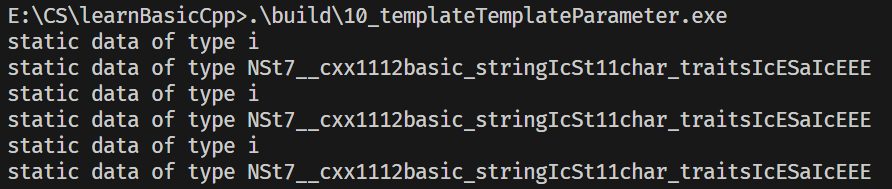

# 模板模板参数（Template Template Parameter）详解
模板模板参数（Template Template Parameter）是 C++ 模板的高级特性，指**模板的参数本身也是一个模板**，而非具体的类型（如 `int`、`std::string`）或数值（如 `10`）。

简单来说：
- 普通模板参数：`template <typename T> class A` → `T` 是具体类型（如 `int`）；
- 模板模板参数：`template <template <class> class C> class B` → `C` 是一个模板（如 `std::vector`）。

该特性的核心价值是**让模板支持更高层级的泛型**，允许我们将“容器模板”作为参数传递，而非仅传递“容器实例类型”。

## 1. 语法基础
### 1.1 基本语法格式
> 说明：以下几种写法都是合法且等价的（C++17 及以上），核心是`class`和`typename`在模板模板参数声明中可互换使用：
```cpp
// 写法1：内层用class，外层用class
template <typename T,          // 普通类型参数（如int、std::string）
          template <class> class Container> // 模板模板参数（接收1个类型参数的模板）
class MyClass {
    Container<T> obj; // 用T实例化模板模板参数，得到具体类型（如Container<int>）
};

// 写法2：内层用class，外层用typename（C++17+支持）
template <typename T,          // 普通类型参数（如int、std::string）
          template <class> typename Container> // 模板模板参数（接收1个类型参数的模板）
class MyClass {
    Container<T> obj; // 用T实例化模板模板参数，得到具体类型（如Container<int>）
};

// 写法3：内层用typename，外层用class
template <typename T,          // 普通类型参数（如int、std::string）
          template <typename> class Container> // 模板模板参数（接收1个类型参数的模板）
class MyClass {
    Container<T> obj; // 用T实例化模板模板参数，得到具体类型（如Container<int>）
};

// 写法4：内层用typename，外层用typename（C++17+支持）
template <typename T,          // 普通类型参数（如int、std::string）
          template <typename> typename Container> // 模板模板参数（接收1个类型参数的模板）
class MyClass {
    Container<T> obj; // 用T实例化模板模板参数，得到具体类型（如Container<int>）
};
```
- 核心规则：C++17 之前，模板模板参数的外层只能用 `class`（如 `template <class> class Container`）；C++17 后可将外层的 `class` 替换为 `typename`，且内层的 `class` 也可替换为 `typename`，语法更统一；
- 本质等价：上述 4 种写法在功能上完全一致，仅语法风格不同，可根据团队编码规范选择。

### 1.2 关键约束：参数数量匹配
模板模板参数的“参数个数”必须与传入的模板完全匹配，这是最容易踩坑的点（如示例代码中的核心问题）。

## 2. 实战示例（基于提供的代码）
### 2.1 问题场景：标准容器的参数不匹配
C++ 标准容器（如 `std::vector`/`std::list`/`std::deque`）的原生模板定义包含**两个参数**：
```cpp
// std::vector的真实定义
template <class T, class Allocator = std::allocator<T>>
class vector;
```
而示例代码中 `XCIs` 类的模板模板参数 `Container` 仅期望**1个参数**：
```cpp
template <typename T, template <class> class Container>
class XCIs;
```
因此直接传入 `std::vector` 会编译报错：
```cpp
XCIs<int, std::vector> xcis; // 错误：std::vector有2个模板参数，仅匹配1个
```
### 2.2 解决方案1：类型别名（using）封装
通过 `template <typename T> using` 为标准容器创建**单参数模板别名**，屏蔽默认的分配器参数：
```cpp
// 封装std::vector为单参数模板
template <typename T>
using Vec = std::vector<T, std::allocator<T>>;

// 同理封装list/deque
template <typename T>
using Lst = std::list<T, std::allocator<T>>;
template <typename T>
using Deq = std::deque<T, std::allocator<T>>;

// 此时可正常使用
XCIs<int, Vec> xcisVec; // Vec是单参数模板，匹配Container的要求
```

### 2.3 解决方案2：调整模板模板参数的参数列表
直接让模板模板参数匹配标准容器的双参数结构，并给第二个参数设置默认值：
```cpp
// 调整Container的参数，匹配std::vector的双参数（第二个参数默认分配器）
template <typename T,
          template <class, class = std::allocator<T>> class Container>
class XCIs {
private:
    Container<T> c; // 第二个参数使用默认值，等价于Container<T, std::allocator<T>>
public:
    // 构造函数逻辑与原代码一致
    XCIs() {
        for (long i = 0; i < SIZE; ++i)
            c.insert(c.end(), T());
        output_static_data(T());
        Container<T> c1(c);
        Container<T> c2(std::move(c));
        c1.swap(c2);
    }
};

// 直接使用std::vector，无需封装
XCIs<int, std::vector> xcis; // 编译通过
```

### 2.4 完整可运行示例（核心逻辑）
```cpp
#include <iostream>
#include <vector>
#include <typeinfo>

#define SIZE 10

// 辅助函数：输出类型信息
template <typename T>
void output_static_data(T) {
    std::cout << "Type: " << typeid(T).name() << std::endl;
}

// 模板模板参数类
template <typename T,
          template <class, class = std::allocator<T>> class Container>
class XCIs {
private:
    Container<T> c;
public:
    XCIs() {
        // 初始化容器
        for (long i = 0; i < SIZE; ++i)
            c.insert(c.end(), T());
        output_static_data(T());
    }
};

int main() {
    // 直接传入std::vector（双参数模板，第二个参数用默认值）
    XCIs<int, std::vector> xcis_vec;
    // 传入std::list
    XCIs<std::string, std::list> xcis_list;
    return 0;
}
```

## 3. 适用场景
1. **通用容器逻辑封装**：编写一套逻辑，适配任意容器（如 `vector`/`list`/`deque`），无需为每种容器重复写代码；
2. **泛型工厂模式**：根据模板参数动态创建不同容器类型的对象；
3. **自定义容器适配器**：实现可替换底层容器的适配器（如自定义栈，支持底层用 `vector` 或 `deque`）；
4. **框架级泛型设计**：如STL源码、Boost库中，用于实现高度复用的泛型组件。

## 4. 注意事项
1. **参数匹配性**：模板模板参数的参数个数、类型（类型参数/非类型参数）必须与传入的模板完全匹配（或通过默认值兼容）；
2. **C++版本兼容**：C++11 开始支持模板别名（`using`），C++17 允许用 `typename` 替代 `class` 声明模板模板参数；
3. **避免过度泛化**：仅在需要“适配不同模板”时使用，普通场景优先使用普通模板参数（如 `template <typename Container>`）。

## 5. 核心总结
1. 模板模板参数是“模板的参数为模板”，用于实现更高层级的泛型设计；
2. 核心坑点是**参数数量匹配**，标准容器的多参数问题可通过“类型别名封装”或“默认参数”解决；
3. C++17 及以上版本中，模板模板参数声明里的 `class` 和 `typename` 可自由互换（内层/外层均支持），本文列举的4种写法均合法有效；
4. 适用场景是需要适配多种容器/模板的通用逻辑，能大幅提升代码复用性。

+ 10_templateTemplateParameter测试

