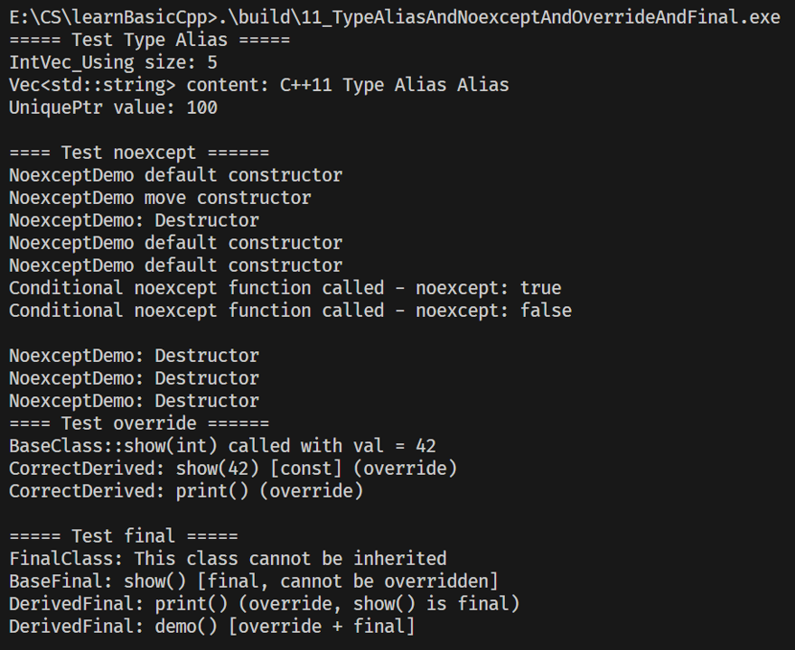

## 1. 核心概念总览
这一节讲 `Type Alias`、`noexcept`、`override`、`final` ，它们是 C++11/14 引入的核心语法特性，分别解决了“类型别名简化”“异常安全控制”“虚函数重写校验”“类/函数不可继承/重写”的问题，是现代 C++ 代码规范、安全性、可读性提升的关键。

## 2. Type Alias（类型别名）
### 2.1 定义与核心价值
Type Alias（类型别名）是 C++11 对传统 `typedef` 的增强，分为两种形式：
- **普通类型别名**：替代 `typedef`，语法更直观；
- **别名模板（Alias Template）**：弥补 `typedef` 无法为模板定义别名的缺陷，支持模板参数化别名。

核心价值：简化复杂类型（尤其是嵌套模板类型）的书写，提升代码可读性和可维护性。

### 2.2 语法格式与代码示例
#### 2.2.1 普通类型别名（替代typedef）
```cpp
// 传统typedef写法
typedef std::vector<int> IntVec;
// Type Alias写法（更直观，推荐）
using IntVec = std::vector<int>;

// 复杂类型示例：函数指针
typedef void (*FuncPtr)(int, std::string); // 传统写法
using FuncPtr = void (*)(int, std::string); // Type Alias写法
```

#### 2.2.2 别名模板（Alias Template）
```cpp
#include <vector>
#include <list>
#include <deque>
#include <memory>

// 模板别名：为带分配器的容器定义简化别名
template <typename T>
using Vec = std::vector<T, std::allocator<T>>;

template <typename T>
using Lst = std::list<T, std::allocator<T>>;

// 模板别名：简化智能指针
template <typename T>
using UniquePtr = std::unique_ptr<T>;

// 实战使用
int main() {
    Vec<int> vec = {1,2,3}; // 等价于std::vector<int, std::allocator<int>>
    Lst<std::string> lst = {"a", "b"}; // 等价于std::list<std::string, std::allocator<std::string>>
    UniquePtr<int> ptr = std::make_unique<int>(10);
    return 0;
}
```

### 2.3 关键优势
- 语法更清晰：`using 别名 = 类型` 符合“赋值”的直觉，比 `typedef` 更易读；
- 支持模板：`typedef` 无法定义模板别名，Type Alias 可通过 `template <typename T> using ...` 实现；
- 嵌套类型更友好：简化迭代器、函数对象等嵌套模板类型的声明。

## 3. noexcept（异常说明符）
### 3.1 定义与核心价值
`noexcept` 是 C++11 引入的异常说明符，用于明确声明：**函数不会抛出任何异常**（或仅抛出指定异常）。

核心价值：
- 编译器可对 `noexcept` 函数做优化（如省略异常处理逻辑）；
- 明确函数的异常安全语义，提升代码可读性；
- 移动构造/移动赋值标记为 `noexcept` 后，STL 容器会优先使用移动语义（而非拷贝）。

### 3.2 语法格式与代码示例
#### 3.2.1 基础语法
```cpp
// 声明函数不会抛出异常
void func1() noexcept;

// 条件式noexcept：仅当表达式为true时，函数不抛异常
template <typename T>
void func2(T&& val) noexcept(std::is_trivially_copyable<T>::value);

// 传统throw()等价于noexcept（C++17后throw()被废弃）
void func3() throw(); // 等价于void func3() noexcept;
```

#### 3.2.2 实战示例（移动语义+noexcept）
```cpp
#include <iostream>
#include <vector>
#include <utility>

class MyClass {
public:
    MyClass() = default;
    
    // 拷贝构造：可能抛异常（内存分配失败）
    MyClass(const MyClass& other) {
        std::cout << "Copy Constructor" << std::endl;
        // 模拟内存分配
        data = new int[100];
        std::copy(other.data, other.data + 100, data);
    }
    
    // 移动构造：不抛异常（仅转移指针），标记noexcept
    MyClass(MyClass&& other) noexcept {
        std::cout << "Move Constructor (noexcept)" << std::endl;
        data = other.data;
        other.data = nullptr; // 避免析构重复释放
    }
    
    ~MyClass() {
        delete[] data;
    }

private:
    int* data = nullptr;
};

int main() {
    std::vector<MyClass> vec;
    vec.reserve(10); // 预分配空间
    vec.emplace_back(); // 构造对象
    vec.push_back(MyClass()); // 移动构造（因noexcept，优先用move而非copy）
    return 0;
}
```
**输出结果**：
```
Move Constructor (noexcept)
```

### 3.3 关键注意事项
- `noexcept` 是“承诺”：若标记为 `noexcept` 的函数实际抛出异常，程序会直接调用 `std::terminate` 终止；
- 移动语义优先：STL 容器的 `push_back`/`emplace_back` 等操作，仅当移动构造/赋值为 `noexcept` 时，才会使用移动语义；
- C++17 后，`throw()` 被废弃，统一使用 `noexcept`。

## 4. override（虚函数重写校验）
### 4.1 定义与核心价值
`override` 是 C++11 引入的关键字，用于显式标记**派生类中重写基类的虚函数**。

核心价值：
- 编译器校验：确保派生类函数确实重写了基类的虚函数（参数、返回值、const 等完全匹配）；
- 提升可读性：明确标记“该函数是重写基类的虚函数”，代码意图更清晰；
- 避免笔误：如基类函数名拼写错误、参数类型不匹配等问题，编译期即可发现。

### 4.2 语法格式与代码示例
#### 4.2.1 错误示例（无override，隐藏bug）
```cpp
class Base {
public:
    virtual void show(int val) const {
        std::cout << "Base: " << val << std::endl;
    }
};

class Derived : public Base {
public:
    // 笔误：参数是double而非int，实际是新函数，而非重写
    virtual void show(double val) const {
        std::cout << "Derived: " << val << std::endl;
    }
};

int main() {
    Base* ptr = new Derived();
    ptr->show(10); // 调用Base::show(int)，而非Derived::show(double)，隐藏bug
    delete ptr;
    return 0;
}
```

#### 4.2.2 正确示例（加override，编译期报错）
```cpp
class Base {
public:
    virtual void show(int val) const {
        std::cout << "Base: " << val << std::endl;
    }
};

class Derived : public Base {
public:
    // 加override后，编译器检测到参数不匹配，直接报错
    virtual void show(double val) const override { // 编译错误：no override found
        std::cout << "Derived: " << val << std::endl;
    }
};

// 修正后
class DerivedFixed : public Base {
public:
    // 参数匹配，override校验通过
    virtual void show(int val) const override {
        std::cout << "DerivedFixed: " << val << std::endl;
    }
};

int main() {
    Base* ptr = new DerivedFixed();
    ptr->show(10); // 调用DerivedFixed::show(int)，输出：DerivedFixed: 10
    delete ptr;
    return 0;
}
```

### 4.3 关键规则
- `override` 只能用于派生类的虚函数；
- 重写要求：函数名、参数列表、const/volatile 限定、返回值（协变返回值除外）必须与基类完全一致；
- `override` 不改变函数的虚属性，仅做编译期校验。

## 5. final（禁止继承/重写）
### 5.1 定义与核心价值
`final` 是 C++11 引入的关键字，有两种用途：
- **修饰类**：禁止该类被继承；
- **修饰虚函数**：禁止派生类重写该虚函数。

核心价值：
- 明确类/函数的设计意图（如工具类不允许继承）；
- 编译器优化：对 `final` 类/函数，编译器可做更多优化（如虚函数调用转为直接调用）；
- 避免非法继承/重写导致的逻辑破坏。

### 5.2 语法格式与代码示例
#### 5.2.1 修饰类（禁止继承）
```cpp
// final修饰类：禁止继承
class FinalClass final {
public:
    void func() {
        std::cout << "This class cannot be inherited" << std::endl;
    }
};

// 编译错误：cannot derive from 'final' class 'FinalClass'
class DerivedFromFinal : public FinalClass {};
```

#### 5.2.2 修饰虚函数（禁止重写）
```cpp
class Base {
public:
    // final修饰虚函数：禁止派生类重写
    virtual void show() final {
        std::cout << "Base::show (cannot be overridden)" << std::endl;
    }
    
    virtual void print() {
        std::cout << "Base::print" << std::endl;
    }
};

class Derived : public Base {
public:
    // 编译错误：virtual function 'show' cannot override 'final' function
    virtual void show() override {}
    
    // 合法：print未被final修饰，可重写
    virtual void print() override {
        std::cout << "Derived::print" << std::endl;
    }
};

int main() {
    Base* ptr = new Derived();
    ptr->print(); // 输出：Derived::print
    ptr->show();  // 输出：Base::show (cannot be overridden)
    delete ptr;
    return 0;
}
```

### 5.3 关键注意事项
- `final` 修饰类时，类的所有成员函数自动无法被重写（因无派生类）；
- `final` 修饰虚函数时，仅禁止该函数被重写，派生类可新增其他虚函数；
- `final` 与 `override` 可配合使用（但 `final` 需写在 `override` 之后）：
  ```cpp
  virtual void func() override final; // 合法：先标记重写，再标记禁止后续重写
  ```

## 6. 适用场景总结
| 特性       | 核心用途                       | 典型场景                                   |
| ---------- | ------------------------------ | ------------------------------------------ |
| Type Alias | 简化复杂类型/模板类型声明      | 容器别名、函数指针别名、模板参数化别名     |
| noexcept   | 声明函数不抛异常，优化移动语义 | 移动构造/赋值、高性能工具函数、STL容器适配 |
| override   | 校验虚函数重写，避免隐藏bug    | 派生类重写基类虚函数（所有场景推荐使用）   |
| final      | 禁止类继承/虚函数重写          | 工具类、核心逻辑函数（防止非法修改）       |

## 7. 核心总结
1. **Type Alias**：`using` 替代 `typedef`，支持模板别名，简化复杂类型声明；
2. **noexcept**：标记函数异常语义，提升性能+确保移动语义被STL优先使用；
3. **override**：显式标记虚函数重写，编译期校验匹配性，避免隐藏bug；
4. **final**：禁止类继承/虚函数重写，明确设计意图+支持编译器优化；
5. 这四个特性均为C++11核心增强，是现代C++代码“规范、安全、高效”的基础，推荐在项目中全面使用。

+ 11_modern_cpp_features测试

