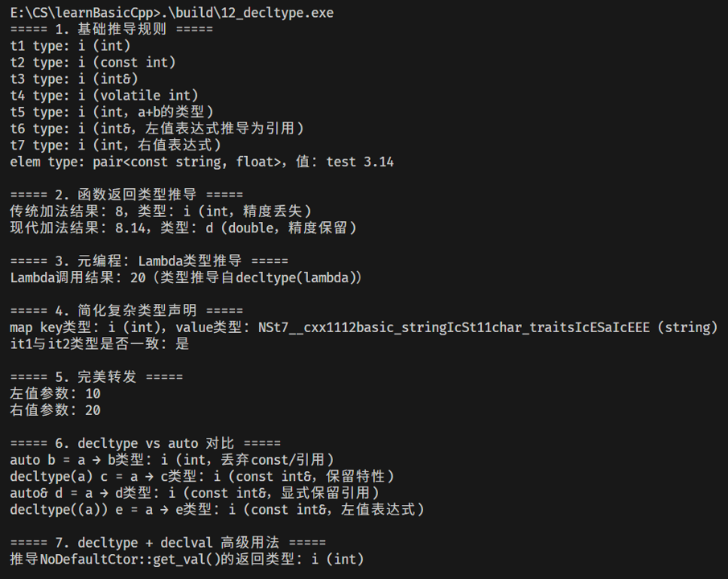

`decltype` 是 C++11 引入的关键字，核心作用是**让编译器推导出一个表达式的类型**，并生成与该类型完全等价的类型别名。它弥补了 C++ 早期 `typeof` 特性（非标准、行为不一致）的缺陷，是现代 C++ 泛型编程、元编程、完美转发的核心基础。

`decltype` 的核心特征：
- 工作在**未求值上下文（unevaluated context）**：仅推导表达式类型，不执行表达式；
- 推导规则精准：能保留表达式的所有类型特征（如 const/volatile、引用、函数类型等）；
- 适用场景广泛：声明函数返回类型、元编程、获取Lambda类型、简化复杂类型声明等。

## 1. 基本语法与推导规则
### 1.1 基础语法格式
```cpp
decltype(expression) // 推导expression的类型，生成等价类型
```
- `expression`：任意合法的 C++ 表达式（变量、函数调用、算术运算、成员访问等）；
- 推导结果：与 `expression` 的静态类型完全一致，且不执行 `expression`（即使表达式包含函数调用，也仅推导返回类型，不调用函数）。

### 1.2 核心推导规则
| 表达式类型           | decltype 推导结果                            | 示例                                  | 推导结果               |
| -------------------- | -------------------------------------------- | ------------------------------------- | ---------------------- |
| 普通变量/常量        | 保留变量的 const/volatile、引用特性          | `const int a = 10; decltype(a)`       | `const int`            |
| 左值表达式（非变量） | 推导为“该类型的左值引用”                     | `int b = 20; decltype((b))`           | `int&`（注意双层括号） |
| 右值表达式           | 推导为表达式的原始类型                       | `decltype(10 + 20)`                   | `int`                  |
| 函数调用             | 推导为函数的返回类型（保留引用/const等特性） | `int& func(); decltype(func())`       | `int&`                 |
| 类成员访问           | 推导为类成员的类型                           | `struct S { int x; }; decltype(S::x)` | `int`                  |

### 1.3 关键示例（基础推导）
```cpp
#include <iostream>
#include <vector>
#include <map>

// 基础类型推导
void basic_deduction() {
    // 1. 普通变量推导
    int a = 10;
    const int b = 20;
    int& c = a;
    volatile int d = 30;

    decltype(a) t1 = 100; // t1: int
    decltype(b) t2 = 200; // t2: const int
    decltype(c) t3 = a; // t3: int&（必须初始化）
    decltype(d) t4 = 400; // t4: volatile int

    // 2. 表达式推导（未求值）
    decltype(a + b) t5 = a + b; // t5: int（a+b是int类型，忽略b的const）
    decltype((a)) t6 = a; // t6: int&（双层括号表示左值表达式）
    decltype(100) t7 = 100; // t7: int（右值表达式）

    // 3. 类成员推导（无需实例化对象）
    std::map<std::string, float> coll;
    decltype(coll)::value_type elem; // elem: pair<const string, float>（等价于map<string,float>::value_type）
}
```

## 2. 核心应用场景
### 2.1 声明函数返回类型（后置返回类型）
C++11 前，函数返回类型必须写在函数名前，无法依赖参数推导；`decltype` 结合后置返回类型（`->`）可实现“根据参数推导返回类型”，是泛型函数的关键。

#### 示例：泛型加法函数
```cpp
// 传统写法：无法推导返回类型，需手动指定
template <typename T1, typename T2>
T1 add(T1 a, T2 b) { return a + b; } // 缺陷：返回类型固定为T1，可能丢失精度

// 现代写法：用decltype推导返回类型
template <typename T1, typename T2>
auto add_modern(T1 a, T2 b) -> decltype(a + b) {
    return a + b; // 返回类型是a+b的实际类型（如int+double→double）
}

void test_return_type() {
    int x = 5;
    double y = 3.14;
    auto res = add_modern(x, y); // res: double（推导自5+3.14的类型）
    std::cout << "res type: " << typeid(res).name() << std::endl; // 输出：d（double）
}
```

### 2.2 元编程与类型萃取
`decltype` 是 C++ 元编程的核心工具，可在编译期推导类型特征，结合模板实现复杂的类型逻辑。

#### 示例：获取Lambda表达式的类型
Lambda 表达式的类型是编译器生成的匿名类型，无法手动声明，只能通过 `decltype` 获取：
```cpp
void metaprogramming() {
    // Lambda表达式的类型是匿名的，需用decltype推导
    auto lambda = [](int x) -> int { return x * 2; };
    decltype(lambda) lambda_copy = lambda; // lambda_copy: 与lambda同类型

    // 调用拷贝后的Lambda
    std::cout << lambda_copy(10) << std::endl; // 输出：20
}
```

### 2.3 简化复杂类型声明
对于 STL 容器、嵌套类型等复杂类型，`decltype` 可简化声明，避免重复书写冗长的类型名。

#### 示例：STL容器成员类型推导
```cpp
void simplify_type() {
    std::vector<std::map<int, std::string>> complex_container;
    
    // 传统写法：冗长且易出错
    std::vector<std::map<int, std::string>>::iterator it1;
    
    // decltype写法：简洁且不易出错
    decltype(complex_container)::iterator it2; // it2: 与it1类型完全一致
    
    // 结合auto+decltype，推导容器元素类型
    for (const auto& elem : complex_container) {
        using MapType = std::remove_const_t<std::remove_reference_t<decltype(elem)>>;
        MapType::key_type key; // key: int（map<int,string>::key_type）
        MapType::mapped_type val; // val: string
    }
}
```

### 2.4 完美转发（Perfect Forwarding）
`decltype` 结合 `std::forward` 实现完美转发，保留参数的左值/右值特性，是现代 C++ 模板函数的核心优化手段。

#### 示例：泛型转发函数
```cpp
#include <utility> // std::forward

// 转发函数：保留参数的左值/右值特性
template <typename Func, typename... Args>
auto forward_func(Func&& func, Args&&... args) -> decltype(func(std::forward<Args>(args)...)) {
    return func(std::forward<Args>(args)...);
}

// 测试函数
void print(int& x) { std::cout << "左值：" << x << std::endl; }
void print(int&& x) { std::cout << "右值：" << x << std::endl; }

void test_forward() {
    int a = 10;
    forward_func(static_cast<void (*)(int &)>(print), a);   // 转发左值，调用print(int&)
    forward_func(static_cast<void (*)(int &&)>(print), 20); // 转发右值，调用print(int&&)
}
```

## 3. decltype 与 auto 的区别
`decltype` 和 `auto` 都能推导类型，但核心目标和规则不同，是互补关系：

| 特性       | decltype                               | auto                                           |
| ---------- | -------------------------------------- | ---------------------------------------------- |
| 推导目标   | 推导表达式的“原始类型”（保留所有特性） | 推导变量的“初始化类型”（会丢弃顶层const/引用） |
| 语法位置   | 可用于任意需要声明类型的位置           | 仅用于变量声明/函数返回类型（auto）            |
| 引用处理   | 保留引用（左值表达式推导为引用）       | 自动丢弃引用（需显式加&保留）                  |
| const 处理 | 保留顶层const                          | 自动丢弃顶层const                              |
| 典型场景   | 函数返回类型、元编程、Lambda类型       | 简化变量声明、泛型变量                         |

### 示例：decltype vs auto
```cpp
void compare_auto_decltype() {
    const int& a = 10;
    
    auto b = a; // b: int（丢弃const和引用）
    decltype(a) c = a; // c: const int&（保留const和引用）
    
    auto& d = a; // d: const int&（显式加&保留引用）
    decltype((a)) e = a; // e: const int&（左值表达式推导为引用）
}
```

## 4. 高级特性：declval
`declval` 是 C++11 配套工具函数（`<utility>`），与 `decltype` 配合使用，核心作用是：**在未求值上下文中，将任意类型 T 转换为引用类型**，从而可以在 `decltype` 中访问类的成员函数/成员变量，无需实例化对象（即使类无默认构造函数）。

### 示例：访问无默认构造函数的类成员
```cpp
#include <utility> // std::declval

// 无默认构造函数的类
class NoDefaultCtor {
public:
    NoDefaultCtor(int x) : val(x) {}
    int get_val() const { return val; }
private:
    int val;
};

void test_declval() {
    // 错误：NoDefaultCtor无默认构造函数，无法实例化
    // NoDefaultCtor obj;
    // decltype(obj.get_val()) t1;

    // 正确：declval将NoDefaultCtor转为引用，无需实例化即可推导成员函数类型
    decltype(std::declval<NoDefaultCtor>().get_val()) t2; // t2: int
}
```

## 5. 核心总结
1. `decltype` 是 C++11 核心特性，用于**推导表达式的原始类型**，工作在未求值上下文，不执行表达式；
2. 推导规则精准：保留 const/volatile、引用、函数返回类型等所有类型特征，双层括号可推导左值引用；
3. 核心应用：后置返回类型、元编程、Lambda类型获取、完美转发、简化复杂类型声明；
4. 与 `auto` 互补：`auto` 简化变量声明，`decltype` 精准推导类型；
5. `declval` 配合 `decltype`：可访问无默认构造函数类的成员，是元编程的关键工具。

+ 12_decltype测试

