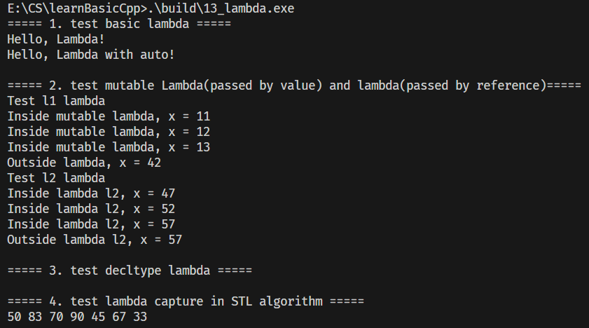

Lambda 表达式是 C++11 引入的匿名函数，基础结构：
```cpp
[capture-list](parameters) mutable noexcept -> return-type { function-body }
```
- **捕获列表（capture-list）**：指定外部变量如何被 Lambda 访问（值捕获/引用捕获）
- **参数列表（parameters）**：同普通函数参数，无参数时可省略 `()`（仅无其他修饰时）
- **mutable**：允许修改值捕获的变量副本（不影响外部原变量）
- **noexcept**：声明 Lambda 是否抛出异常（throwSpec）
- **返回类型**：可省略，编译器自动推导
- **函数体**：Lambda 执行逻辑

使用如：

```cpp
// 定义并立即调用 Lambda（无捕获、无参数）
[] { std::cout << "Hello, Lambda!" << std::endl; }();

// 赋值给 auto 变量后调用
auto l = [] { std::cout << "Hello, Lambda with auto!" << std::endl; };
l();
```
**关键特性**：
- 无捕获、无参数的 Lambda 可省略参数列表 `()`；
- Lambda 本质是匿名函数对象，可通过 `auto` 存储后复用。

## 1. Mutable 与捕获方式（值捕获 vs 引用捕获）
Lambda 捕获外部变量分两种核心方式，`mutable` 仅影响值捕获的行为。

### 1.1 值捕获（`[x]`）+ mutable
```cpp
int x = 10;
auto l1 = [x]() mutable {
    ++x; // mutable 允许修改捕获的变量副本
    std::cout << "Inside mutable lambda, x = " << x << std::endl;
};
x = 42;  // 外部变量修改不影响 Lambda 内的副本
l1();    // 输出：11（副本自增）
l1();    // 输出：12（副本持续自增）
std::cout << "Outside lambda, x = " << x << std::endl; // 输出：42（原变量不受影响）
```
**核心规则**：
- 值捕获：Lambda 创建时拷贝外部变量，默认情况下副本只读，`mutable` 解除只读限制；
- 副本的修改不会影响外部原变量，即使外部变量后续被修改，Lambda 内的副本也不变。

### 1.2 引用捕获（`[&x]`）
```cpp
int x = 10;
auto l2 = [&x](int param) {
    x += param; // 引用捕获可直接修改外部变量，无需 mutable
    std::cout << "Inside lambda l2, x = " << x << std::endl;
};
x = 42;   // 外部变量修改会同步到 Lambda 引用
l2(5);    // 输出：47（42+5）
l2(5);    // 输出：52（47+5）
std::cout << "Outside lambda l2, x = " << x << std::endl; // 输出：52（原变量被修改）
```
**核心规则**：
- 引用捕获：Lambda 直接引用外部变量，修改会同步到外部；
- 无需 `mutable` 即可修改，需注意外部变量的生命周期（避免悬垂引用）。

### 1.3 错误示例（值捕获无 mutable 修改）
```cpp
// 编译报错：x 是只读变量
int x = 10;
auto l3 = [x]() {
    ++x; // 无 mutable，值捕获的副本只读，无法修改
};
```

## 2. Lambda 作为容器比较器（decltype 应用）
Lambda 可作为自定义比较器传入 STL 容器（如 `std::set`），需结合 `decltype` 指定比较器类型。

### 2.1 示例代码
```cpp
struct Person {
    std::string lastName;
    std::string firstName;
    Person(std::string ln, std::string fn) : lastName(ln), firstName(fn) {}
};

// 自定义比较规则的 Lambda
auto cmp = [](const Person &x, const Person &y) {
    return x.lastName < y.lastName || (x.lastName == y.lastName && x.firstName < y.firstName);
};

// 声明 set 时，比较器类型为 decltype(cmp)，且必须传入 Lambda 实例
std::set<Person, decltype(cmp)> sorted_set(cmp);

// 错误：无默认构造函数，必须显式传入比较器实例
// std::set<Person, decltype(cmp)> sorted_set2;
```
**核心规则**：
- `std::set` 的第二个模板参数是比较器类型，Lambda 无固定类型，需用 `decltype(cmp)` 推导；
- 用 Lambda 作为比较器的容器，**必须在构造时传入 Lambda 实例**（无法默认构造）。

## 3. Lambda 在 STL 算法中的应用（捕获外部变量）
Lambda 常作为谓词（判断条件）传入 STL 算法，通过捕获列表复用外部变量，简化代码。

### 3.1 示例代码（std::remove_if）
```cpp
std::vector<int> vi{5, 28, 50, 83, 70, 90, 12, 45, 67, 33};
int x = 30;
int y = 100;

// 移除 vi 中 <30 或 >100 的元素
vi.erase(std::remove_if(vi.begin(), vi.end(), [x, y](int val) {
    return val < x || val > y;
}), vi.end());

// 输出结果：28 50 83 70 90 45 67 33
for (int i : vi) {
    std::cout << i << " ";
}
```
**核心优势**：
- 无需定义独立的函数/函数对象，直接在算法调用处编写判断逻辑；
- 通过捕获列表（`[x, y]`）灵活引用外部变量，适配不同的判断条件。

## 总结
1. Lambda 核心结构：`[捕获列表](参数) 修饰符 -> 返回值 { 逻辑 }`，无参数且无修饰时可省略参数列表；
2. 值捕获默认只读，`mutable` 允许修改副本（不影响外部），引用捕获可直接修改外部变量；
3. Lambda 可作为容器比较器（需 `decltype` + 构造传实例）或算法谓词（捕获外部变量简化逻辑），是 C++ 简化代码的核心工具。
 
+ 13_lambda测试

