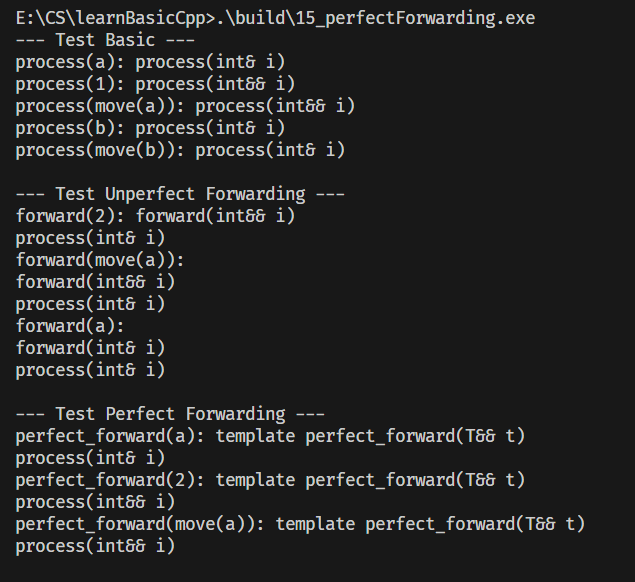

C++ `std::move` 与完美转发（`std::forward`）为了解决的问题是：
- **std::move**：将左值转换为右值引用，启用移动语义，避免深拷贝。
- **std::forward**：根据参数的“值类别”（左值/右值），选择合适的引用类型转发，保持参数的原始属性。

## 1. 核心概念铺垫：左值/右值与引用折叠
### 1.1 核心定义回顾
- **左值（Lvalue）**：有名称、可寻址、生命周期持久（如变量 `a`、`const int& b`）；
- **右值（Rvalue）**：无名称、不可寻址、临时存在（如字面量 `1`、`std::move(a)` 转换后的对象）；
- **万能引用（Universal Reference）**：仅出现在模板参数 `T&&` 或 `auto&&` 场景，可接收左值/右值，本质是“引用折叠”的产物。

### 1.2 引用折叠规则（关键）
C++ 不允许“引用的引用”，编译器会按以下规则折叠引用类型，这是 `std::move` 和 `std::forward` 的底层基础：
| 原始引用组合 | 折叠后类型 | 示例                         |
| ------------ | ---------- | ---------------------------- |
| `T& &`       | `T&`       | 左值引用+左值引用 → 左值引用 |
| `T& &&`      | `T&`       | 左值引用+右值引用 → 左值引用 |
| `T&& &`      | `T&`       | 右值引用+左值引用 → 左值引用 |
| `T&& &&`     | `T&&`      | 右值引用+右值引用 → 右值引用 |

**核心结论**：只要有一个左值引用参与，最终结果就是左值引用；只有两个都是右值引用，才会折叠为右值引用。

## 2. std::move 机制解析
### 2.1 源码拆解
```cpp
template<typename _Tp>
constexpr typename std::remove_reference<_Tp>::type&&
move(_Tp&& __t) noexcept
{ 
    return static_cast<typename std::remove_reference<_Tp>::type&&>(__t); 
}
```
#### 关键组件解析
1. `std::remove_reference<_Tp>::type`：
   - 类型萃取工具，作用是**移除 `_Tp` 的引用特性**（如 `int&` → `int`，`int&&` → `int`）；
   - 确保最终转换的目标类型是“纯类型的右值引用”。

2. 模板参数 `_Tp&& __t`：
   - 万能引用，可接收左值（如 `int&`）或右值（如 `int&&`）；
   - 传入左值时，`_Tp` 推导为 `T&`；传入右值时，`_Tp` 推导为 `T`。

3. `static_cast` 强制转换：
   - 仅做**类型转换**，不执行任何“移动资源”操作；
   - 核心目标：将任意类型的参数转为“纯类型的右值引用”。

### 2.2 std::move 执行流程（分场景）
#### 场景1：传入左值（如 `int a; std::move(a)`）
- 模板参数推导：`_Tp` = `int&`（因为传入左值，万能引用折叠为左值引用）；
- `std::remove_reference<_Tp>::type` = `int`（移除引用）；
- 转换目标：`int&&`；
- 最终：`static_cast<int&&>(a)` → 将左值 `a` 强制转为右值引用。

#### 场景2：传入右值（如 `std::move(1)`）
- 模板参数推导：`_Tp` = `int`（传入右值，万能引用保持右值引用）；
- `std::remove_reference<_Tp>::type` = `int`；
- 转换目标：`int&&`；
- 最终：`static_cast<int&&>(1)` → 右值仍转为右值引用（无实质变化）。

### 2.3 std::move 核心特性
- **仅类型转换**：不修改参数值、不转移资源，只是“标记”对象可被移动；
- **不保证安全性**：转换后的左值（如 `a`）仍可访问，但资源所有权应视为已转移，后续使用可能导致未定义行为；
- **无开销**：编译期完成类型推导，运行期无任何额外开销。

## 3. 完美转发（std::forward）机制解析
### 3.1 源码拆解
#### 版本1：处理左值
```cpp
template<typename _Tp>
constexpr _Tp&&
forward(typename std::remove_reference<_Tp>::type& __t) noexcept
{ 
    return static_cast<_Tp&&>(__t); 
}
```
#### 版本2：处理右值
```cpp
template<typename _Tp>
constexpr _Tp&&
forward(typename std::remove_reference<_Tp>::type&& __t) noexcept
{
    static_assert(!std::is_lvalue_reference<_Tp>::value, "模板参数不能是左值引用");
    return static_cast<_Tp&&>(__t);
}
```

### 3.2 完美转发核心目标
解决“**右值传入函数后变为左值**”的问题，保证参数的“左值/右值特性”在函数调用链中不丢失。

### 3.3 核心原理：“保持原始值类别”
`std::forward` 是“条件转换”：
- 若参数原始是左值 → 转发后仍为左值；
- 若参数原始是右值 → 转发后仍为右值；
- 实现依赖：模板参数显式指定原始类型，结合引用折叠规则。

### 3.4 测试代码说明（不完美转发 vs 完美转发）
#### 测试代码问题：右值传入后变为左值
```cpp
void forward(int &&i)
{
    cout << "forward(int&& i)" << endl;
    process(i); // 问题：i是右值引用，但本身是左值（有名称、可寻址），调用process(int&)
}

// 调用场景
forward(2); // 2是右值，进入forward(int&& i)，但process(i)调用左值版本
forward(move(a)); // 同理，process(i)调用左值版本
```

#### 修复：使用 std::forward 实现完美转发
修改 `forward` 函数为模板版（完美转发版）：
```cpp
// 完美转发模板函数
template<typename T>
void perfect_forward(T&& i) // 万能引用
{
    cout << "perfect_forward: ";
    process(std::forward<T>(i)); // 保持原始值类别
}
```

#### 完美转发执行流程（分场景）
##### 场景1：传入左值（如 `int a; perfect_forward(a)`）
- 模板参数推导：`T` = `int&`（左值 → 万能引用折叠为左值引用）；
- `std::forward<T>(i)` = `std::forward<int&>(i)`；
- 转换：`static_cast<int& &&>(i)` → 引用折叠为 `int&` → 转发为左值；
- 结果：调用 `process(int&)`。

##### 场景2：传入右值（如 `perfect_forward(2)`）
- 模板参数推导：`T` = `int`（右值 → 万能引用保持右值引用）；
- `std::forward<T>(i)` = `std::forward<int>(i)`；
- 转换：`static_cast<int&&>(i)` → 转发为右值；
- 结果：调用 `process(int&&)`。

##### 场景3：传入 `std::move(a)`（左值转右值）
- 模板参数推导：`T` = `int`；
- `std::forward<T>(i)` 转换为 `int&&`；
- 结果：调用 `process(int&&)`。

## 4. move 与 forward 的核心区别
| 特性     | std::move                                    | std::forward                                     |
| -------- | -------------------------------------------- | ------------------------------------------------ |
| 核心目标 | 无条件将参数转为右值引用                     | 有条件保持参数原始值类别（左值→左值，右值→右值） |
| 类型转换 | 单向：左值→右值，右值→右值                   | 双向：按模板参数保持原始类型                     |
| 使用场景 | 明确要转移资源所有权（如容器插入、移动构造） | 函数参数转发（模板中保持值类别）                 |
| 模板参数 | 自动推导                                     | 必须显式指定原始类型（如 `std::forward<T>(i)`）  |

## 5. 关键总结
1. **std::move 本质**：编译期类型转换工具，将任意参数转为右值引用，仅标记“可移动”，无运行期开销；
2. **完美转发核心**：依赖万能引用（`T&&`）和引用折叠规则，通过 `std::forward<T>` 保持参数原始的左值/右值特性，解决“右值传入函数后变为左值”的问题；
3. **你的测试代码问题**：非模板的 `forward(int&& i)` 中，`i` 是右值引用但本身是左值，导致 `process(i)` 调用左值版本；完美转发需用模板+`std::forward` 实现；
4. **使用准则**：
   - 转移资源时用 `std::move`（如 `vec.insert(end(), std::move(str))`）；
   - 转发参数时用 `std::forward`（如模板函数中传递参数）。

+ 15_perfectForwarding测试

