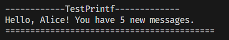

C++的可变参数模板（Variadic Templates）是C++11引入的强大特性，允许模板接受任意数量、任意类型的参数。这为元编程、泛型编程和库设计提供了极大的灵活性，常用于实现类型安全的可变参数函数、容器扩展和元组操作等场景。


### **基本概念**
1. **可变参数模板参数包（Parameter Pack）**
- **模板参数包**：用 `...` 表示，允许模板接受任意数量的类型参数。
```cpp
template<typename... Args>  // Args 是类型参数包
struct Tuple {};

Tuple<int, double, std::string> t;  // 合法，参数包包含3个类型
```
- **函数参数包**：用 `...` 修饰参数，允许函数接受任意数量的参数。
```cpp
template<typename... Args>
void print(Args... args) {  // args 是函数参数包
   // 实现见下文
}
```

1. **参数包展开（Pack Expansion）**
- 通过 `...` 展开参数包，将其分解为独立的参数。
- 展开方式包括递归、折叠表达式（C++17）等。


### **递归展开参数包**
递归是处理参数包的传统方法，通过模板特化逐步处理每个参数：

```cpp
#include <iostream>

// 递归终止函数
void print() {
    std::cout << std::endl;
}

// 递归展开函数
template<typename T, typename... Args>
void print(T first, Args... args) {
    std::cout << first << (sizeof...(args) ? ", " : "");
    print(args...);  // 递归调用，每次减少一个参数
}

int main() {
    print(1, 2.5, "hello");  // 输出: 1, 2.5, hello
}
```

**解释**：
- 第一个 `print()` 是终止函数，当参数包为空时调用。
- 第二个 `print()` 是递归函数，处理当前参数 `first` 后，递归展开剩余参数 `args...`。


### **折叠表达式（C++17）**
C++17引入折叠表达式，简化了参数包的处理：

```cpp
#include <iostream>

template<typename... Args>
void print(Args... args) {
    (std::cout << ... << args) << std::endl;  // 一元右折叠表达式
}

int main() {
    print(1, 2.5, "hello");  // 输出: 12.5hello
}
```

**折叠表达式语法**：
- **一元右折叠**：`(pack op ...)` 展开为 `(arg1 op (arg2 op (... op argN)))`。
- **一元左折叠**：`(... op pack)` 展开为 `(((arg1 op arg2) op ...) op argN)`。
- **二元折叠**：`(init op pack op ...)` 或 `(... op pack op init)`，包含初始值。


### **应用场景**
1. **实现类型安全的 `printf`**
```cpp
void printf(const char *s)
{
    while (*s)
    {
        if (*s == '%' && *(++s) != '%')
            throw std::logic_error("invalid format string: missing arguments");
        std::cout << *s++;
    }
}
template <typename T, typename... Args>
void printf(const char *s, T value, Args... args)
{
    while (*s)
    {
        if (*s == '%' && *(++s) != '%')
        {
            std::cout << value;
            printf(++s, args...);
            return;
        }
        std::cout << *s++;
    }
    throw std::logic_error("extra arguments provided to printf");
}
```

2. **元组（Tuple）实现**
```cpp
template<typename... Args>
struct Tuple {};

template<typename Head, typename... Tail>
struct Tuple<Head, Tail...> : Tuple<Tail...> {
    Head value;
    Tuple(Head h, Tail... t) : Tuple<Tail...>(t...), value(h) {}
};
```

3. **转发参数到其他函数**
```cpp
template<typename... Args>
void forward(Args&&... args) {
    other_function(std::forward<Args>(args)...);
}
```


### **注意事项**
1. **参数包展开顺序**：
   - 递归展开时，参数按从左到右的顺序处理。
   - 折叠表达式的展开顺序由操作符优先级决定（如右折叠 `(a + (b + c))`）。

2. **参数包为空的情况**：
   - 某些折叠表达式在参数包为空时可能导致编译错误，需特殊处理。

3. **类型安全**：
   - 可变参数模板是类型安全的，编译器会检查每个参数的类型。


### **总结**
可变参数模板是C++元编程的核心工具，通过参数包和递归/折叠表达式，可以处理任意数量和类型的参数。它广泛应用于标准库（如 `std::tuple`、`std::make_shared`）和现代C++框架中，提升了代码的灵活性和复用性。


--------------------------------
+ printX测试


+ hash测试


+ tuple测试


+ printf测试

