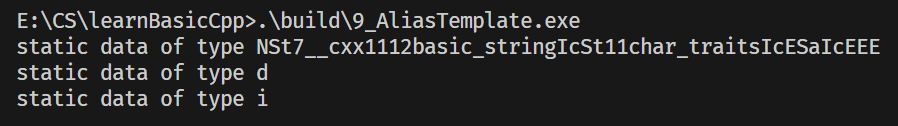

Alias Template（别名模板）是C++11引入的特性，用于为**模板类型**定义别名（类似`typedef`，但`typedef`无法为模板定义别名）。它的核心作用是简化复杂的模板类型声明，提升代码可读性和可维护性。

**基础语法**：
```cpp
// 通用格式
template <typename T>
using 别名 = 原模板类型<T>;

// 示例：为vector<T>定义别名Vec
template <typename T>
using Vec = std::vector<T>;
```

### 1. 为什么需要Alias Template？
示例代码中出现了`typedef typename iterator_traits<typename Container::iterator>::value_type ValType;`这样冗长的类型声明，而Alias Template可以极大简化这类场景：
- 简化嵌套/复杂模板类型的书写；
- 统一模板类型的命名规范，降低出错概率；
- 支持模板参数的部分特化（比`typedef`更灵活）。

### 2. 结合示例代码的实战示例
我们先修复示例代码中的模板错误，再用Alias Template优化：

```cpp
#include <vector>
#include <iostream>
#include <iterator> // 补充iterator_traits所需头文件
using namespace std;
#define SIZE 10

// ========== 修复并优化test_moveable函数 ==========
// 版本1：双模板参数版本（修复原代码中Container<T>的错误）
template <typename Container, typename T>
void test_moveable(Container, T elem)
{
    Container c;
    for (long i = 0; i < SIZE; ++i)
        c.insert(c.end(), T());
    output_static_data(T());
    Container c1(c);
    Container c2(std::move(c));
    c1.swap(c2);
}

// 别名2：简化vector<T>的书写（可选）
template <typename Container>
void test_moveable(Container c)
{
    // 别名：简化迭代器值类型的获取（typedef和using替代）
    typedef typename iterator_traits<typename Container::iterator>::value_type ValType;
    using ValType2 = typename iterator_traits<typename Container::iterator>::value_type;
    for (long i = 0; i < SIZE; ++i)
        c.insert(c.end(), ValType());
    output_static_data(ValType2());
    Container c1(c);
    Container c2(std::move(c));
    c1.swap(c2);
}

// 只能用using, typedef不能带参数
template <typename T>
using IntContainer = vector<T, allocator<T>>;

int main()
{
    // 测试1：双参数版本（推导Container=vector<string>, T=string）
    test_moveable(vector<string>(), string(""));
    // 测试2：单参数版本（推导Container=vector<double>，自动获取ValType=double）
    test_moveable(vector<double>());
    // 测试3：单参数版本（推导Container=IntContainer<int>，自动获取ValType=int）
    test_moveable(IntContainer<int>());
    return 0;
}
```

### 3. **原代码的核心错误**：
   - 在`test 1/test 2`中写了`Container<T> c;`，但`Container`是被推导的具体类型（如`vector<int>`），而非模板类，因此不能加`<T>`；
   - 缺少`<iterator>`头文件，导致`iterator_traits`无法使用；
   - `typename`关键字仅用于指明“嵌套类型是类型而非变量”，不能修饰变量声明（如`typename Container<T> c;`是错误的）。


### 总结
1. **核心定义**：Alias Template（`template <...> using 别名 = 类型;`）是C++11为模板类型定义别名的特性，弥补了`typedef`无法处理模板的缺陷；
2. **核心优势**：简化复杂/嵌套模板类型的书写（如迭代器值类型推导），提升代码可读性；
3. **避坑要点**：模板参数推导时，`Container`是具体类型（如`vector<int>`），而非模板类，因此不能写`Container<T>`；`typename`仅用于修饰嵌套类型，不能修饰变量。

通过Alias Template优化后，代码不仅修复了原有的模板语法错误，还变得更简洁、易维护，这也是Alias Template在实际开发中的核心应用场景。

+ 9_AliasTemplate测试

