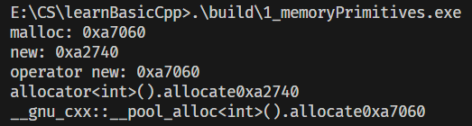
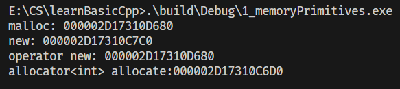

C++ 提供了多层级的内存分配与释放机制，从底层 C 风格函数到 C++ 标准库组件，形成了完整的内存管理体系。本文将详细介绍四种核心内存分配/释放方式：

1.  **`malloc()` / `free()`**：C 语言标准库函数，直接操作堆内存。
2.  **`new` / `delete`**：C++ 关键字，在分配内存的同时执行对象构造/析构。
3.  **`::operator new()` / `::operator delete()`**：C++ 底层内存分配/释放函数，可被重载。
4.  **`allocator<T>::allocate()` / `deallocate()`**：C++ 标准库分配器，用于 STL 容器的内存管理。


## 1. 四种内存管理方式详解

### 1.1 `malloc()` / `free()` —— C 风格内存管理
- **归属**：C 标准库函数（`<cstdlib>` / `<malloc.h>`）
- **核心特性**：
  - 仅分配/释放**原始内存块**，不执行任何对象构造/析构。
  - 分配的内存是**未初始化**的，内容为随机值。
  - 不可重载，行为固定。
- **代码示例**：
  ```cpp
  void *p1 = malloc(512); // 分配 512 字节的原始内存
  std::cout << "malloc: " << p1 << std::endl;
  free(p1);               // 释放内存，不调用析构函数
  ```
- **关键说明**：
  - `malloc()` 返回 `void*`，需手动转换为目标类型指针。
  - 若分配失败，返回 `nullptr`（C++11 后）或 `NULL`。
  - 必须成对使用，`free()` 只能释放由 `malloc()` / `calloc()` / `realloc()` 分配的内存。


### 1.2 `new` / `delete` —— C++ 对象式内存管理
- **归属**：C++ 关键字（表达式）
- **核心特性**：
  - 是**两步操作**的封装：先分配内存，再调用构造函数初始化对象；释放时先调用析构函数，再释放内存。
  - 自动处理类型大小，无需手动计算字节数。
  - 不可重载，但其底层调用的 `operator new`/`operator delete` 可以重载。
- **代码示例**：
  ```cpp
  // 分配并构造一个 std::complex<int> 对象
  complex<int> *p2 = new complex<int>; 
  std::cout << "new: " << p2 << std::endl;
  delete p2; // 先调用析构函数，再释放内存
  ```
- **关键说明**：
  - `new` 会自动计算所需内存大小（`sizeof(complex<int>)`）。
  - 若分配失败，默认抛出 `std::bad_alloc` 异常（可通过 `new(nothrow)` 返回 `nullptr`）。
  - 数组版本 `new[]` / `delete[]` 必须成对使用，否则会导致未定义行为。

### 1.3 `::operator new()` / `::operator delete()` —— C++ 底层内存函数
- **归属**：C++ 标准库函数（`<new>`）
- **核心特性**：
  - 行为与 `malloc()` 类似，仅分配/释放原始内存，不执行对象构造/析构。
  - 是 `new` 关键字底层调用的函数。
  - **可重载**，允许自定义内存分配策略（如内存池）。
- **代码示例**：
  ```cpp
  // 全局 ::operator new，分配 512 字节原始内存
  void *p3 = ::operator new(512); 
  std::cout << "operator new: " << p3 << std::endl;
  ::operator delete(p3); // 释放内存
  ```
- **关键说明**：
  - 全局 `::operator new` 可被重载，也可在类内重载以实现类特定的内存管理。
  - 若分配失败，默认抛出 `std::bad_alloc` 异常。
  - 数组版本 `operator new[]` / `operator delete[]` 对应 `new[]` / `delete[]`。

### 1.4 `allocator<T>::allocate()` / `deallocate()` —— C++ 标准库分配器
- **归属**：C++ 标准库模板（`<memory>`）
- **核心特性**：
  - 是 STL 容器（如 `vector`, `list`）默认使用的内存分配器，将内存管理与对象构造分离。
  - `allocate(n)` 分配足够容纳 `n` 个 `T` 类型对象的**未初始化内存**。
  - `deallocate(p, n)` 释放由 `allocate(n)` 分配的内存。
  - 可自由设计并搭配任何容器，提供高度的灵活性（如 GCC 的 `__pool_alloc` 池分配器）。
- **代码示例**：
```cpp
  // 使用MSVC的allocator分配内存
#ifdef _MSC_VER
    int *p4 = allocator<int>().allocate(3, (int *)0);
    std::cout << "allocator<int> allocate:" << p4 << std::endl;
    allocator<int>().deallocate(p4, 3);
#endif

  // 使用 GCC 扩展的 __pool_alloc 池分配器
#ifdef __GNUC__
    void *p4 = allocator<int>().allocate(7);
    std::cout << "allocator<int>().allocate" << p4 << std::endl;
    allocator<int>().deallocate((int *)p4, 7);

    void *p5 = __gnu_cxx::__pool_alloc<int>().allocate(7);
    std::cout << "__gnu_cxx::__pool_alloc<int>().allocate" << p5 << std::endl;
    __gnu_cxx::__pool_alloc<int>().deallocate((int *)p5, 7);
#endif
```
- **关键说明**：
  - `allocator<T>` 本身不负责对象的构造与析构，需配合 `std::construct` / `std::destroy` 使用。
  - 自定义分配器（如内存池、栈分配器）是高性能 C++ 程序的常见优化手段。


## 2. 核心对比与总结

| 分配/释放方式                               | 归属       | 核心行为                                  | 是否可重载             | 典型应用场景                          |
| :------------------------------------------ | :--------- | :---------------------------------------- | :--------------------- | :------------------------------------ |
| `malloc()` / `free()`                       | C 函数     | 仅分配/释放原始内存                       | 不可                   | C 风格代码、底层内存操作              |
| `new` / `delete`                            | C++ 关键字 | 分配内存 + 构造对象 / 析构对象 + 释放内存 | 不可（底层函数可重载） | 单个对象的创建与销毁                  |
| `::operator new()` / `::operator delete()`  | C++ 函数   | 仅分配/释放原始内存                       | 可                     | 自定义内存分配策略、实现 `new` 关键字 |
| `allocator<T>::allocate()` / `deallocate()` | C++ 模板   | 分配/释放未初始化内存，分离内存与对象     | 可                     | STL 容器、自定义容器、高性能内存池    |


## 3. 代码示例运行说明

```cpp
#include "malloc.h"
#include <complex>
#include <iostream>
#include <memory>
#if __GNUC__
#include "ext/pool_allocator.h"
#endif
using namespace std;
int main()
{
    void *p1 = malloc(512);
    std::cout << "malloc: " << p1 << std::endl;
    free(p1);

    complex<int> *p2 = new complex<int>;
    std::cout << "new: " << p2 << std::endl;
    delete p2;

    void *p3 = ::operator new(512);
    std::cout << "operator new: " << p3 << std::endl;
    ::operator delete(p3);

#ifdef _MSC_VER
    int *p4 = allocator<int>().allocate(3, (int *)0);
    std::cout << "allocator<int> allocate:" << p4 << std::endl;
    allocator<int>().deallocate(p4, 3);
#endif

#ifdef __GNUC__
    void *p4 = allocator<int>().allocate(7);
    std::cout << "allocator<int>().allocate" << p4 << std::endl;
    allocator<int>().deallocate((int *)p4, 7);

    void *p5 = __gnu_cxx::__pool_alloc<int>().allocate(7);
    std::cout << "__gnu_cxx::__pool_alloc<int>().allocate" << p5 << std::endl;
    __gnu_cxx::__pool_alloc<int>().deallocate((int *)p5, 7);
#endif

    return 0;
}
```
- **编译运行**：示例代码可在 GCC 和 MSVC 下编译，GCC 会额外演示 `__pool_alloc` 池分配器。
- **输出**：将打印出每种方式分配的内存地址，直观展示不同层级的内存管理。


## 4. 核心总结
1.  **层级关系**：`new`/`delete` 建立在 `operator new`/`operator delete` 之上，而后者通常又调用 `malloc`/`free`；STL 容器则使用 `allocator`。
2.  **职责分离**：`malloc`/`operator new`/`allocator` 负责**内存分配**，`new` 关键字在此基础上增加了**对象构造**的职责。
3.  **选择建议**：
    - 日常开发优先使用 `new`/`delete` 或智能指针。
    - 自定义内存管理时，重载 `operator new`/`operator delete` 或实现自定义 `allocator`。
    - 与 C 代码交互或需要纯原始内存时，使用 `malloc`/`free`。

+ 1_memoryPrimitives测试

g++测试：



msvc测试：

