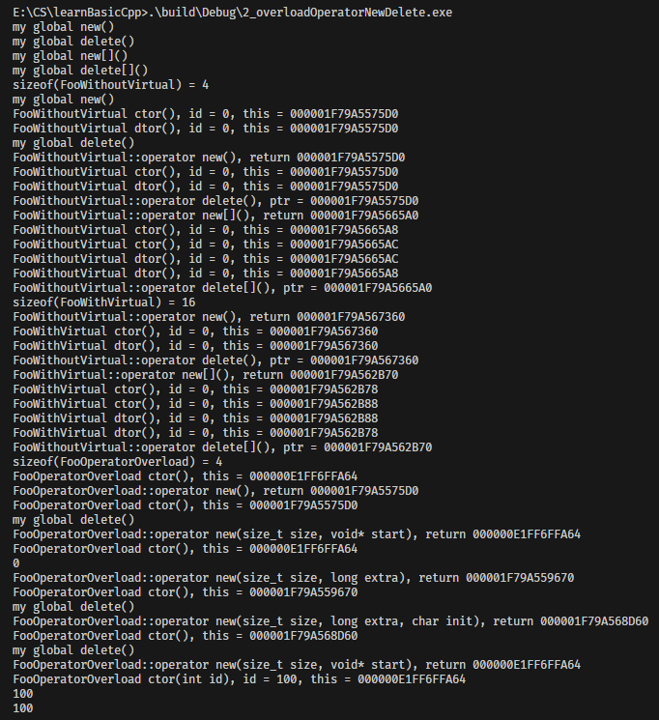

`operator new`/`operator delete` 是 C++ 内存分配的底层核心函数，`new`/`delete` 关键字本质是对这些函数的封装：
- `new T` → 先调用 `operator new(sizeof(T))` 分配内存，再调用 `T` 的构造函数；
- `delete p` → 先调用 `p` 指向对象的析构函数，再调用 `operator delete(p)` 释放内存；
- 数组版本 `new[]/delete[]` 对应 `operator new[]/operator delete[]`，逻辑与普通版本一致。

重载 `operator new/delete` 的核心价值是**自定义内存分配策略**（如内存池、日志监控、对齐优化），分为「全局重载」和「类内重载」两类，本文结合实战代码详解重载规则与使用场景。

## 1. 重载分类与语法规则
### 1.1 全局重载（作用于整个程序）
#### 语法格式
全局重载需定义在全局命名空间，函数签名固定（不可修改参数/返回值）：
```cpp
// 普通版本（对应 new 关键字）
void* operator new(size_t size) {
    // size：需要分配的内存字节数（由编译器自动传递）
    // 返回值：分配的内存首地址（void*）
}

// 数组版本（对应 new[] 关键字）
void* operator new[](size_t size) {
    // size：数组总内存字节数（包含数组元信息 + 元素内存）
}

// 普通版本（对应 delete 关键字）
void operator delete(void* ptr) noexcept {
    // ptr：需要释放的内存地址（nullptr 需兼容）
}

// 数组版本（对应 delete[] 关键字）
void operator delete[](void* ptr) noexcept {
}
```

#### 代码示例（全局重载）
```cpp
#include <iostream>
#include <cstdlib>
using namespace std;

// 自定义内存分配/释放函数
void *myAlloc(size_t size) { return malloc(size); }
void myFree(void *ptr) { free(ptr); }

// 全局重载 operator new
inline void *operator new(size_t size) {
    cout << "my global new()" << endl;
    return myAlloc(size);
}

// 全局重载 operator new[]
inline void *operator new[](size_t size) {
    cout << "my global new[]()" << endl;
    return myAlloc(size);
}

// 全局重载 operator delete
inline void operator delete(void *ptr) {
    cout << "my global delete()" << endl;
    myFree(ptr);
}

// 全局重载 operator delete[]
inline void operator delete[](void *ptr) {
    cout << "my global delete[]()" << endl;
    myFree(ptr);
}
```

### 1.2 类内重载（仅作用于该类对象）
#### 语法格式
类内重载需定义为类的**静态成员函数**（编译器自动处理，无需显式写 `static`），签名与全局版本一致：
```cpp
class Foo {
public:
    // 类内重载 operator new（仅用于 Foo 对象的分配）
    void* operator new(size_t size) {
        // size = sizeof(Foo)（编译器自动传递）
    }

    // 类内重载 operator new[]（仅用于 Foo 数组的分配）
    void* operator new[](size_t size) {
        // size = 数组元信息大小 + 3*sizeof(Foo)（如 new Foo[3]）
    }

    // 类内重载 operator delete
    void operator delete(void* ptr) noexcept {
    }

    // 类内重载 operator delete[]
    void operator delete[](void* ptr) noexcept {
    }
};
```

一般的，使用`new`一个类，会使用类里的`operator new`，如果类里没有定义`operator new`，则会使用全局的`operator new`。如果在`new`前面加上`::`，则会使用全局的`operator new`（如果这个全局的`operator new`没有定义重载，就会使用系统默认的`operator new`）。

类内重载还可以进行`placement new`，即指定内存地址分配。它的语法格式为：

```cpp
// 基础格式：在 ptr 指向的内存地址构造 T 类型对象
new (ptr) T;

// 带参数格式：在 ptr 指向的内存地址构造 T 类型对象，并传递参数给构造函数
new (ptr) T(args...);

// 扩展格式：支持多参数传递（参数会被传递给 operator new 的重载版本）
new (arg1, arg2, ...) T(args...);
```

重载`operator new`必须满足的条件是：

+ 第一个参数固定为 size_t size（对象内存大小，编译器自动传递）；
+ 后续参数为自定义参数（与调用时的 (arg1, arg2...) 匹配）；
+ 返回值为 void*（构造对象的内存地址）。

如果`operator new`返回的内存是在栈上分配的，那么不能直接使用`delete`来释放内存。

#### 代码示例（类内重载）
```cpp
class Foo
{
public:
    Foo() { cout << "Foo ctor" << endl; }
    ~Foo() { cout << "Foo dtor" << endl; }

    // 类内重载普通 new
    void *operator new(size_t size)
    {
        cout << "Foo global new()" << endl;
        return myAlloc(size);
    }

    // 类内重载普通 delete
    void operator delete(void *ptr)
    {
        cout << "Foo global delete()" << endl;
        myFree(ptr);
    }

    // 类内重载数组 new[]
    void *operator new[](size_t size)
    {
        cout << "Foo global new[]()" << endl;
        return myAlloc(size);
    }

    // 类内重载数组 delete[]
    void operator delete[](void *ptr)
    {
        cout << "Foo global delete[]()" << endl;
        myFree(ptr);
    }
};
```

## 2. 重载函数的调用规则
### 2.1 优先级规则（核心）
1. **类内重载 > 全局重载 > 系统默认**：若类定义了专属的 `operator new`，则该类对象的内存分配优先使用类内版本；未定义则使用全局重载；全局未重载则使用系统默认版本。
2. **显式指定全局版本**：通过 `::operator new` 可强制调用全局重载（跳过类内版本）。


## 3. 重载的核心注意事项
### 3.1 函数签名不可修改
- `operator new/new[]` 必须接收 `size_t` 类型参数（内存大小），返回 `void*`；
- `operator delete/delete[]` 必须接收 `void*` 参数，返回 `void`，建议加 `noexcept`（保证异常安全）；
- 数组版本的 `operator new[]` 的 `size` 参数包含「数组元信息」（存储数组长度），因此 `new Foo[3]` 的 `size` 会略大于 `3*sizeof(Foo)`。

### 3.2 必须成对重载
- 重载 `operator new` 时，建议同时重载 `operator delete`（避免内存泄漏）；
- 重载 `operator new[]` 时，必须重载 `operator delete[]`（数组释放依赖）。

### 3.3 兼容 nullptr
`operator delete` 的参数可能是 `nullptr`（如 `delete nullptr`），因此函数内需判断指针有效性：
```cpp
void operator delete(void *ptr) noexcept {
    if (ptr == nullptr) return; // 兼容空指针
    cout << "Foo global delete()" << endl;
    myFree(ptr);
}
```

### 3.4 类内重载的作用域
类内重载仅对该类的对象生效，子类若未重载则继承父类版本（或回退到全局版本）：
```cpp
class Bar : public Foo {};
Bar* b = new Bar; // 调用 Foo::operator new（Bar 未重载）
```

## 4. 重载的典型应用场景
### 4.1 内存池优化
重载 `operator new/delete` 接入自定义内存池，减少 `malloc/free` 的系统调用开销（高频小对象分配场景）：
```cpp
void* operator new(size_t size) {
    return memory_pool.allocate(size); // 从内存池分配
}

void operator delete(void* ptr) noexcept {
    memory_pool.deallocate(ptr); // 归还到内存池
}
```

### 4.2 内存分配日志/监控
记录内存分配的大小、地址、调用栈，用于内存泄漏排查：
```cpp
void* operator new(size_t size) {
    void* ptr = malloc(size);
    cout << "分配内存：size=" << size << ", addr=" << ptr << endl;
    return ptr;
}

void operator delete(void* ptr) noexcept {
    cout << "释放内存：addr=" << ptr << endl;
    free(ptr);
}
```

### 4.3 内存对齐优化
针对特殊硬件/场景（如 SIMD 指令、DMA 传输），重载函数实现指定字节对齐：
```cpp
void* operator new(size_t size) {
    // 分配 16 字节对齐的内存
    return aligned_alloc(16, (size + 15) & ~15);
}
```

## 5. 核心总结
1. `operator new/delete` 是 `new/delete` 关键字的底层实现，分为普通版（单个对象）和数组版（`new[]/delete[]`）；
2. 重载分为「全局版」（作用于所有对象）和「类内版」（仅作用于该类对象），类内版本优先级更高；
3. 调用规则：`new T` → `operator new(sizeof(T))` + 构造函数；`delete p` → 析构函数 + `operator delete(p)`；
4. 重载核心注意：签名固定、成对重载、兼容 nullptr、数组版 size 包含元信息；
5. 典型应用：内存池、日志监控、内存对齐，是高性能 C++ 程序的核心优化手段。

+ 2_overloadOperatorNewDelete测试

