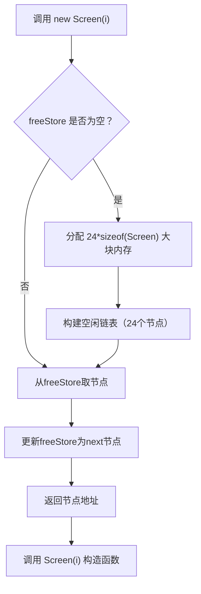
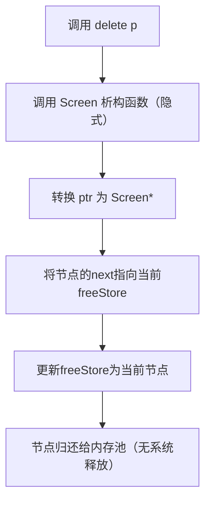
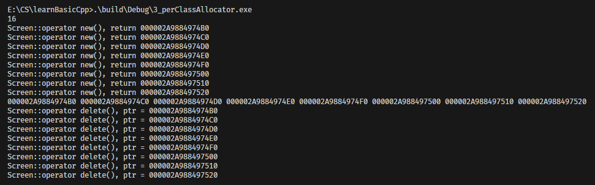

本节的`Screen`类是一个**Per-Class Allocator（按类分配器）**，是 C++ 针对「单个类」定制的内存分配策略，核心是通过重载类的 `operator new/delete`，为该类对象实现专属的内存池（Memory Pool）管理。

与全局分配器（如系统默认的 `malloc/free`）相比，Per-Class Allocator 解决了高频小对象分配的两大痛点：
- 系统 `new/delete` 频繁调用导致的性能开销（用户态/内核态切换）；
- 内存碎片（大量小对象分配/释放后，堆内存被分割成零散块）。

## 1. Per-Class Allocator 核心设计思想
### 1.1 核心目标
为指定类（如 `Screen`）打造「专属内存池」：
1. **预分配大块内存**：首次创建对象时，一次性分配能容纳多个对象的大块内存（而非单个对象）；
2. **复用空闲内存**：对象释放时不归还系统，而是归还给内存池，后续创建对象时直接从内存池取，无需重新分配；
3. **按需分配，延迟释放**：仅在内存池无空闲节点时才分配新内存，程序结束前统一释放大块内存（或复用）。

### 1.2 设计核心（内存池+链表管理）
Per-Class Allocator 的核心是「空闲链表（Free List）」，通过链表管理内存池中的空闲节点：
- **空闲链表**：用类的静态成员指针 `freeStore` 指向链表头部，每个节点（`Screen` 对象）的 `next` 指针指向下一个空闲节点；
- **分配逻辑**：从空闲链表头部取节点，更新链表头；
- **释放逻辑**：将释放的节点插回空闲链表头部，更新链表头。

### 1.3 设计原则
1. **类内封装**：内存池的管理逻辑（`freeStore`、`screenChunk`、`operator new/delete`）全部封装在类内，对外透明；
2. **静态共享**：内存池相关成员（`freeStore`、`screenChunk`）设为静态，所有类对象共享同一内存池；
3. **最小侵入**：对外仍使用标准 `new/delete` 语法，无需修改业务代码；
4. **性能优先**：避免频繁系统调用，仅在内存池耗尽时才分配新内存。

## 2. Screen 类 Per-Class Allocator 实现解析
### 2.1 类结构设计（核心成员）
```cpp
class Screen
{
public:
    // 业务构造函数
    Screen(int x) : id(x) {}
    int get() { return id; }

    // 重载 operator new（内存分配）
    void *operator new(size_t size);
    // 重载 operator delete（内存释放）
    void operator delete(void *ptr);

private:
    // 空闲链表节点指针：指向下一个空闲对象
    Screen *next;
    // 静态成员：空闲链表头（所有对象共享）
    static Screen *freeStore;
    // 静态常量：每次预分配的对象数量（内存池块大小）
    static const int screenChunk;

    // 业务数据
    int id;
};

// 静态成员初始化
Screen *Screen::freeStore = nullptr;
const int Screen::screenChunk = 24;
```
#### 关键成员说明
| 成员          | 作用                                                                               |
| ------------- | ---------------------------------------------------------------------------------- |
| `next`        | 非业务成员，仅用于构建空闲链表，是内存池管理的核心（利用类的内存布局存储链表指针） |
| `freeStore`   | 静态指针，指向空闲链表的头部，初始为 `nullptr`（内存池未初始化）                   |
| `screenChunk` | 静态常量，每次预分配 24 个 `Screen` 对象的内存（可根据业务调整）                   |

### 2.2 operator new 实现（内存分配逻辑）
```cpp
void *Screen::operator new(size_t size)
{
    Screen *p;
    // 1. 内存池未初始化/无空闲节点 → 预分配大块内存
    if (!freeStore)
    {
        // 计算大块内存总大小：24 * sizeof(Screen)
        size_t chunk = screenChunk * size;
        // 分配原始内存（char[] 保证字节级分配），转换为 Screen*
        freeStore = reinterpret_cast<Screen *>(new char[chunk]);
        
        // 2. 构建空闲链表：初始化 24 个节点的 next 指针
        for (p = freeStore; p != &freeStore[screenChunk - 1]; ++p)
            p->next = p + 1; // 每个节点指向后一个节点
        // 最后一个节点的 next 设为 nullptr（链表尾）
        freeStore[screenChunk - 1].next = nullptr;
    }

    // 3. 从空闲链表头部取一个节点分配
    p = freeStore;
    freeStore = freeStore->next; // 链表头后移
    std::cout << "Screen::operator new(), return " << p << std::endl;
    return p;
}
```
#### 分配流程（核心逻辑）


### 2.3 operator delete 实现（内存释放逻辑）
```cpp
void Screen::operator delete(void *ptr)
{
    // 转换为 Screen* 指针
    Screen *p = reinterpret_cast<Screen *>(ptr);
    // 1. 将释放的节点插回空闲链表头部
    p->next = freeStore;
    // 2. 更新空闲链表头为当前节点
    freeStore = p;
    std::cout << "Screen::operator delete(), ptr = " << ptr << std::endl;
}
```
#### 释放流程（核心逻辑）


### 2.4 主函数调用与运行逻辑
```cpp
int main()
{
    {
        // 输出 Screen 大小：包含 int(id) + 指针(next) + 内存对齐（64位下为 16 字节）
        std::cout << sizeof(Screen) << std::endl;

        size_t const N = 8;
        Screen *p[N];
        // 分配 8 个 Screen 对象（从内存池取）
        for (size_t i = 0; i < N; ++i)
            p[i] = new Screen(i);

        // 打印对象地址（连续，验证内存池分配）
        for (size_t i = 0; i < N; ++i)
            cout << p[i] << std::endl;

        // 释放 8 个对象（归还给内存池）
        for (size_t i = 0; i < N; ++i)
            delete p[i];
    }
    return 0;
}
```

## 3. Per-Class Allocator 核心优势
### 3.1 性能提升
- 减少系统调用：首次分配 24 个对象的内存，后续 23 次 `new` 无需调用系统 `new`；
- 内存分配/释放仅需修改链表指针（O(1) 时间复杂度），远快于系统 `malloc/free`（需遍历内存块）。

### 3.2 减少内存碎片
- 预分配的大块内存是连续的，对象地址连续，避免堆内存被零散分割；
- 释放的对象归还给内存池，而非系统，后续可直接复用，减少碎片产生。

### 3.3 类级别的隔离
- 内存池仅服务于 `Screen` 类，不会影响其他类的内存分配；
- 不同类可定制不同的 `screenChunk`（预分配数量），适配不同业务场景。

### 3.4 透明性
- 对外仍使用标准 `new/delete` 语法，业务代码无需修改，低侵入性。

-------------------------------------

+ 3_perClassAllocator测试



备注：

- 地址间隔为 16 字节（`sizeof(Screen)`），验证内存池分配的是连续内存；
- 8 次 `new` 仅触发 1 次大块内存分配（内存池初始化）；
- 8 次 `delete` 仅将节点归还给内存池，无系统内存释放。