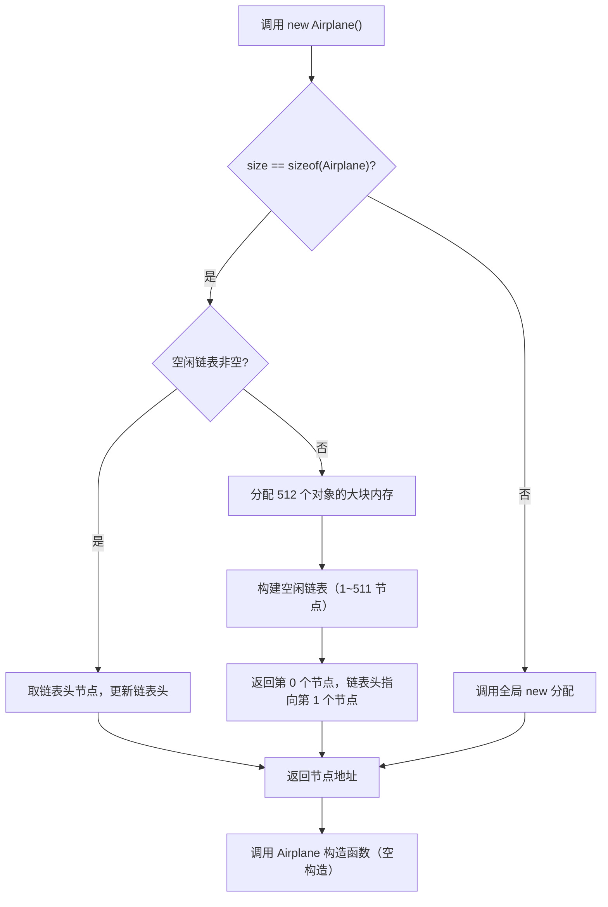
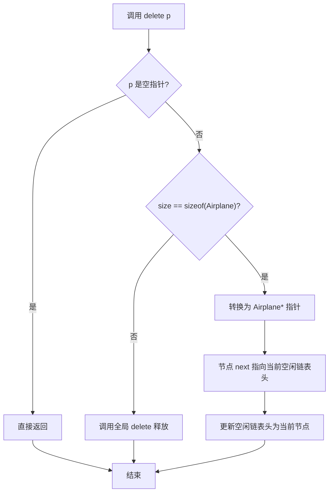
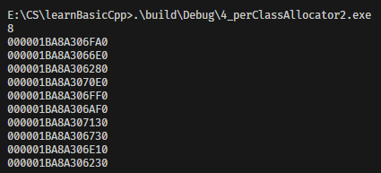
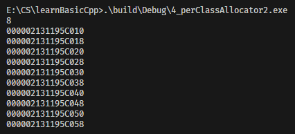

[3_perClassAllocator](../3_perClassAllocator)的传统 Per-Class Allocator每一个类都需要在类中额外增加 `next` 指针成员存储空闲链表信息，这会**增加类的内存开销**（64位系统下额外占用8字节）。而改进的Airplane类通过 `union` 实现嵌入式指针，复用业务数据的内存空间，既实现内存池管理，又不增加类的大小。嵌入式指针是一种**内存复用**设计技巧：在类的内存布局中，复用对象的部分内存空间存储内存池的管理指针（如空闲链表指针），仅当对象处于「空闲状态（在内存池）」时使用该指针，「使用状态」时则恢复为业务数据。

| 设计方案               | 内存开销                  | 核心原理                 |
| ---------------------- | ------------------------- | ------------------------ |
| 传统内存池（Screen）   | 业务数据 + 额外 next 指针 | 单独的链表指针成员       |
| 嵌入式指针（Airplane） | 仅业务数据大小            | union 复用内存，状态切换 |

## 1. Airplane 类核心设计解析
### 1.1 类结构设计（核心：Union 实现嵌入式指针）
```cpp
class Airplane
{
private:
    // 业务数据结构：对象处于「使用状态」时的有效数据
    struct AirplaneRep
    {
        unsigned long miles; // 飞行里程
        char type;           // 飞机类型
    };

private:
    // 核心：Union 复用内存（嵌入式指针的关键）
    union
    {
        AirplaneRep rep;   // 「使用中」：存储业务数据
        Airplane *next;    // 「空闲中」：存储空闲链表指针
    };

public:
    // 业务接口：操作 rep 成员（仅对象使用时调用）
    unsigned long getMiles() const { return rep.miles; }
    char getType() const { return rep.type; }
    void set(unsigned long m, char t) { rep.miles = m; rep.type = t; }

public:
    static void *operator new(size_t size);   // 重载 new：内存池分配
    static void operator delete(void *deadObject, size_t size); // 重载 delete：归还内存池

private:
    static const int BLOCK_SIZE;       // 内存池单次预分配对象数（512）
    static Airplane *headOfFreeList;   // 空闲链表头指针（静态共享）
};

// 静态成员初始化
Airplane *Airplane::headOfFreeList = nullptr;
const int Airplane::BLOCK_SIZE = 512;
```

#### 关键结构说明
1. **AirplaneRep**：封装对象的所有业务数据，占用内存为 `sizeof(unsigned long) + sizeof(char)`（64位系统下为 8+1=9 字节，内存对齐后为 16 字节）；
2. **Union 联合体**：
   - 大小等于最大成员的大小（此处 `AirplaneRep` 和 `Airplane*` 均为 16 字节，因此 union 占 16 字节）；
   - 对象「使用中」：`rep` 有效，存储 `miles` 和 `type`；
   - 对象「空闲中」：`next` 有效，存储空闲链表的下一个节点地址；
3. **静态成员**：`headOfFreeList` 管理空闲链表，`BLOCK_SIZE` 定义单次预分配 512 个 Airplane 对象的内存块。

### 1.2 内存布局对比（64位系统）
| 类           | 传统设计（Screen）            | 嵌入式指针（Airplane）       |
| ------------ | ----------------------------- | ---------------------------- |
| 成员         | int id (4) + Screen* next (8) | union（AirplaneRep 16 字节） |
| 内存对齐     | 补 4 字节 → 总计 16 字节      | 无需额外补充 → 总计 16 字节  |
| 有效数据占比 | 4/16 = 25%                    | 16/16 = 100%                 |

> 核心价值：嵌入式指针让内存池管理「零内存开销」，所有内存均用于业务数据或临时管理指针。

### 1.3 operator new 实现（内存池分配逻辑）
```cpp
void *Airplane::operator new(size_t size)
{
    // 防御性检查：处理继承场景（子类调用基类 new 时 size 不匹配）
    if (size != sizeof(Airplane))
        return ::operator new(size);

    Airplane *p = headOfFreeList;
    // 场景1：空闲链表有节点 → 直接取头节点分配
    if (p)
        headOfFreeList = p->next; // 链表头后移
    // 场景2：空闲链表为空 → 预分配大块内存构建新链表
    else
    {
        // 分配 512 个 Airplane 对象的大块内存
        Airplane *newBlock = static_cast<Airplane *>(::operator new(BLOCK_SIZE * sizeof(Airplane)));
        
        // 构建空闲链表：newBlock[0] 直接返回，newBlock[1~511] 加入链表
        for (int i = 1; i < BLOCK_SIZE - 1; ++i)
            newBlock[i].next = &newBlock[i + 1];
        newBlock[BLOCK_SIZE - 1].next = nullptr; // 链表尾
        
        p = newBlock; // 返回第一个节点
        headOfFreeList = &newBlock[1]; // 链表头指向第二个节点
    }
    return p;
}
```

#### 分配流程核心逻辑


### 1.4 operator delete 实现（内存池释放逻辑）
```cpp
void Airplane::operator delete(void *deadObject, size_t size)
{
    // 空指针直接返回（防御性检查）
    if (deadObject == nullptr)
        return;

    // 继承场景：调用全局 delete 释放
    if (size != sizeof(Airplane))
    {
        ::operator delete(deadObject);
        return;
    }

    // 核心：将释放的对象插回空闲链表头部
    Airplane *p = static_cast<Airplane *>(deadObject);
    p->next = headOfFreeList; // 当前节点指向原链表头
    headOfFreeList = p;       // 链表头更新为当前节点
}
```

#### 释放流程核心逻辑


### 1.5 主函数调用与运行验证
```cpp
int main()
{
    {
        // 输出 Airplane 大小：16 字节（union 大小）
        std::cout << sizeof(Airplane) << std::endl;

        size_t const N = 100;
        Airplane *p[N];
        // 分配 100 个 Airplane 对象（仅首次分配大块内存）
        for (size_t i = 0; i < N; ++i)
            p[i] = new Airplane();
        
        // 业务操作：设置部分对象的业务数据
        p[1]->set(1000, 'A');
        p[2]->set(2000, 'B');
        p[9]->set(9000, 'C');
        
        // 打印前 10 个对象地址（连续，验证内存池分配）
        for (size_t i = 0; i < 10; ++i)
            cout << p[i] << std::endl;

        // 释放 100 个对象（全部归还给空闲链表）
        for (size_t i = 0; i < N; ++i)
            delete p[i];
    }
    return 0;
}
```


## 2. 嵌入式指针的核心设计思想
### 2.1 状态分离
将对象分为两种互斥状态，通过 union 复用内存：
- **使用状态**：对象被业务逻辑持有，union 存储 `AirplaneRep`（业务数据）；
- **空闲状态**：对象在内存池等待分配，union 存储 `next`（链表指针）。

> 关键前提：对象的两种状态不会同时发生，因此 union 复用是安全的。

### 2.2 零开销管理
传统内存池的链表指针是「永久开销」，而嵌入式指针的管理指针是「临时开销」：仅当对象空闲时占用内存，使用时完全释放给业务数据，实现「管理逻辑零内存成本」。

### 2.3 防御性编程
- **size 检查**：处理继承场景（子类未重载 `operator new` 时，调用基类 `new` 会导致 `size` 不等于 `sizeof(Airplane)`）；
- **空指针检查**：避免 `delete nullptr` 导致的未定义行为；
- **大块内存分配**：单次预分配 512 个对象，减少系统 `new` 调用次数，提升性能。

## 3. 关键注意事项与扩展
### 3.1 内存对齐问题
- union 的大小由最大成员决定，需确保 `AirplaneRep` 和 `Airplane*` 的内存对齐一致（64位系统下指针为 8 字节，`AirplaneRep` 需对齐到 8 字节，编译器会自动补全）；
- 若业务数据大小小于指针大小（如 4 字节），union 仍会占用指针大小（8 字节），此时嵌入式指针无内存优势，建议使用传统设计。

### 3.2 线程安全
原代码未考虑多线程场景，多线程下需为空闲链表操作加锁：
```cpp
#include <mutex>
// 类内添加静态互斥锁
static std::mutex poolMutex;

// operator new 中加锁
void *Airplane::operator new(size_t size)
{
    std::lock_guard<std::mutex> lock(poolMutex);
    // ... 原有逻辑 ...
}

// operator delete 中加锁
void Airplane::operator delete(void *deadObject, size_t size)
{
    std::lock_guard<std::mutex> lock(poolMutex);
    // ... 原有逻辑 ...
}
```

### 3.3 内存池释放（避免泄漏）
原代码中预分配的大块内存未释放（程序退出时系统回收），可添加静态析构函数：
```cpp
// 类内声明
static void freePool();

// 类外实现
void Airplane::freePool() {
    std::lock_guard<std::mutex> lock(poolMutex);
    if (headOfFreeList) {
        // 遍历空闲链表，释放所有大块内存（需记录每个块的起始地址）
        // 简化版：释放第一个块（实际场景需改进）
        Airplane* blockStart = headOfFreeList;
        while (blockStart->next) {
            blockStart = blockStart->next;
        }
        ::operator delete(blockStart);
        headOfFreeList = nullptr;
    }
}

// main 末尾调用
int main() {
    // ... 业务逻辑 ...
    Airplane::freePool();
    return 0;
}
```

### 3.4 适用场景
嵌入式指针适用于：
- 业务数据大小 ≥ 指针大小（64位下 ≥ 8 字节）；
- 对象频繁创建/释放（如服务器请求对象、游戏实体对象）；
- 对内存开销敏感的场景（如嵌入式系统、高频小对象）。

## 4. 核心总结
1. **嵌入式指针核心**：通过 union 复用对象内存，「使用中」存储业务数据，「空闲中」存储链表指针，实现内存池管理零开销；
2. **Airplane 类设计亮点**：
   - 无额外内存开销：union 复用内存，类大小仅等于业务数据大小；
   - 防御性检查：处理继承、空指针等边界场景；
   - 高性能：单次预分配 512 个对象，减少系统调用；
3. **关键原则**：对象的「使用状态」和「空闲状态」互斥，是 union 复用的安全前提；
4. **扩展建议**：补充线程安全锁、内存池释放逻辑，适配多线程和长期运行的程序。

嵌入式指针是 C++ 高性能内存池的经典设计，广泛应用于 STL 容器（如 `std::allocator`）、高性能服务器、游戏引擎等场景，是「空间换时间」设计思想的极致体现（用临时的内存复用，换取永久的内存开销节省）。

+ 4_perClassAllocator2测试
  + 没有重载operator new/delete

  + 重载了operator new/delete


说明：

+ **未重载 `operator new/delete`**：对象地址是零散、跳跃的，间隔远大于 `sizeof(Airplane)=8` 字节（比如 `0xC07784B2F0 → 0xC07784BD40`，间隔约 `0x50` 字节）。这是系统默认 `malloc/new` 的行为：每次分配会额外存储堆管理元信息（如块大小、校验位、链表指针等），同时堆分配器为了对齐和管理，会在对象之间留下空隙，导致地址不连续。
+ **重载了 `operator new/delete`（`Per-Class Allocator`）**：对象地址是连续、紧凑的，间隔正好是 `sizeof(Airplane)=8` 字节（比如 `0x2595114C7A0 → 0x2595114C7A8`，间隔 `0x8` 字节）。这是类专属内存池的行为：一次性预分配一大块连续内存，然后按对象大小（8 字节）切分，所以地址是紧密连续的，没有额外元信息和空隙。