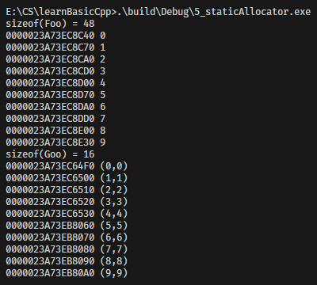

前面的per Class Allocator需要对每一个类进行繁琐的内存管理定义，我们可以把分配内存的逻辑抽象为一个静态分配器，也就是将**内存池逻辑封装为独立类**，并通过类的**静态成员**关联到目标类（如 `Foo`/`Goo`）的内存分配策略。核心特点：
- 分配器类（`Allocator`）独立封装内存池管理逻辑（`allocate/deallocate`），与业务类解耦；
- 业务类（`Foo`/`Goo`）通过**静态成员变量**持有分配器实例，所有对象共享同一内存池；
- 业务类重载 `operator new/delete`，调用分配器的接口完成内存分配/释放。

| 设计方案                       | 耦合度                     | 复用性                              | 扩展性                    |
| ------------------------------ | -------------------------- | ----------------------------------- | ------------------------- |
| 传统Per-Class Allocator        | 高（内存池逻辑嵌入业务类） | 低（无法复用）                      | 差（修改需改业务类）      |
| 静态分配器（Static Allocator） | 低（分配器独立封装）       | 高（多个业务类可复用同一Allocator） | 好（仅修改Allocator即可） |

## 1. 代码结构与核心设计解析
### 1.1 独立分配器类（Allocator）
```cpp
class Allocator
{
private:
    // 空闲链表节点结构（仅存储next指针）
    struct obj
    {
        struct obj *next;
    };

public:
    // 内存分配：从内存池取节点，无空闲则预分配大块内存
    void *allocate(size_t size);
    // 内存释放：将节点归还给内存池（插回空闲链表）
    void deallocate(void *ptr, size_t size);

private:
    obj *freeStore = nullptr; // 空闲链表头指针
    const int CHUNK = 5;      // 单次预分配的对象数量（5个）
};
```
#### 核心方法实现
```cpp
// 内存分配逻辑
void *Allocator::allocate(size_t size)
{
    obj *p;
    // 场景1：空闲链表为空 → 预分配5个对象的大块内存
    if (!freeStore)
    {
        size_t chunk = CHUNK * size; // 大块内存总大小：5 * 单个对象大小
        freeStore = p = (obj *)malloc(chunk); // 分配原始内存
        
        // 构建空闲链表：每个节点指向后一个节点（间隔为单个对象大小）
        for (int i = 0; i < CHUNK - 1; ++i)
        {
            p->next = (obj *)((char *)p + size); // 按size偏移，保证对齐
            p = p->next;
        }
        p->next = nullptr; // 链表尾
    }

    // 场景2：从空闲链表头取节点分配
    p = freeStore;
    freeStore = freeStore->next; // 链表头后移
    return p;
}

// 内存释放逻辑
void Allocator::deallocate(void *ptr, size_t size)
{
    // 将释放的节点插回空闲链表头部
    ((obj *)ptr)->next = freeStore;
    freeStore = (obj *)ptr;
}
```

### 1.2 业务类关联静态分配器（Foo/Goo）
#### Foo类（绑定静态Allocator）
```cpp
class Foo
{
public:
    long L;
    string str;
    static Allocator alloc; // 静态分配器实例（所有Foo对象共享）

public:
    Foo(long l, const string &s) : L(l), str(s) {}
    // 重载new：调用静态分配器的allocate
    static void *operator new(size_t size)
    {
        return alloc.allocate(size);
    }
    // 重载delete：调用静态分配器的deallocate
    static void operator delete(void *ptr, size_t size)
    {
        alloc.deallocate(ptr, size);
    }
};
Allocator Foo::alloc; // 静态分配器实例初始化
```

#### Goo类（复用同一Allocator）
```cpp
class Goo
{
public:
    complex<double> c;
    static Allocator alloc; // 独立的静态分配器实例（与Foo不共享）

public:
    Goo(const complex<double> &x) : c(x) {}
    // 重载new/delete，逻辑与Foo一致
    static void *operator new(size_t size)
    {
        return alloc.allocate(size);
    }
    static void operator delete(void *ptr, size_t size)
    {
        alloc.deallocate(ptr, size);
    }
};
Allocator Goo::alloc; // 静态分配器实例初始化
```

### 1.3 主函数调用逻辑
```cpp
int main()
{
    {
        // 测试Foo类：分配10个对象（需预分配2次大块内存，每次5个）
        Foo *p[10];
        cout << "sizeof(Foo) = " << sizeof(Foo) << endl;
        for (int i = 0; i < 10; ++i)
        {
            p[i] = new Foo(i, "hello");
            cout << p[i] << " " << p[i]->L << endl;
        }
        for (int i = 0; i < 10; ++i)
            delete p[i];
    }

    {
        // 测试Goo类：分配10个对象（同理，预分配2次大块内存）
        Goo *p[10];
        cout << "sizeof(Goo) = " << sizeof(Goo) << endl;
        for (int i = 0; i < 10; ++i)
        {
            p[i] = new Goo(complex<double>(i, i));
            cout << p[i] << " " << p[i]->c << endl;
        }
        for (int i = 0; i < 10; ++i)
            delete p[i];
    }
    return 0;
}
```


## 2. 静态分配器核心设计思想
### 2.1 解耦与复用
- **分配器与业务类解耦**：`Allocator` 类独立封装内存池逻辑，Foo/Goo仅需通过静态成员关联，无需重复编写内存池代码；
- **多类复用同一分配器**：Foo和Goo均可使用 `Allocator`，且各自持有独立的静态实例，内存池互不干扰。

### 2.2 静态共享
- 每个业务类的 `Allocator` 实例是**静态成员**，所有该类对象共享同一内存池；
- 避免为每个对象创建分配器实例，减少内存开销（静态成员属于类，而非对象）。

### 2.3 按需预分配
- `CHUNK=5` 表示单次预分配5个对象的内存，平衡「系统调用次数」和「内存利用率」：
  - 预分配减少malloc调用次数（10个Foo对象仅需2次malloc）；
  - 小CHUNK值避免内存浪费（若仅需少量对象，不会分配过多内存）。

### 4.4 内存对齐保证
- 分配时通过 `(char *)p + size` 偏移节点地址，确保每个节点的起始地址符合对象的内存对齐要求（size是对象大小，已包含对齐）；
- 避免因地址未对齐导致的运行时错误（如访问未对齐的double/long）。

## 3. 关键注意事项与扩展
### 3.1 静态分配器的独立性
- Foo和Goo的 `alloc` 是独立的静态实例，因此它们的内存池完全隔离：Foo的空闲链表不会被Goo使用，反之亦然；
- 若需多个类共享同一内存池，可将 `Allocator` 实例定义为全局变量，而非类静态成员。

### 3.2 线程安全
- 原代码未加锁，多线程下并发调用 `allocate/deallocate` 会导致空闲链表错乱（数据竞争）；
- 扩展方案：在Allocator中添加互斥锁，保护空闲链表操作：
  ```cpp
  #include <mutex>
  class Allocator
  {
  private:
      std::mutex mtx; // 互斥锁
      // ... 其他成员 ...
  public:
      void *allocate(size_t size)
      {
          std::lock_guard<std::mutex> lock(mtx); // 加锁
          // ... 原有逻辑 ...
      }
      void deallocate(void *ptr, size_t size)
      {
          std::lock_guard<std::mutex> lock(mtx); // 加锁
          // ... 原有逻辑 ...
      }
  };
  ```

### 3.3 内存泄漏问题
- Allocator中通过malloc分配的大块内存，在程序结束前未释放（delete仅归还到空闲链表，未调用free）；
- 扩展方案：为Allocator添加析构逻辑，释放所有预分配的大块内存：
  ```cpp
  class Allocator
  {
  public:
      ~Allocator()
      {
          obj *p = freeStore;
          while (p)
          {
              obj *next = p->next;
              free(p); // 释放单个大块内存
              p = next;
          }
          freeStore = nullptr;
      }
      // ... 其他成员 ...
  };
  ```

### 3.4 适配不同CHUNK大小
- 原代码CHUNK固定为5，可改为动态参数（如构造函数传入），适配不同业务类的需求：
  ```cpp
  class Allocator
  {
  private:
      const int CHUNK;
  public:
      Allocator(int chunk) : CHUNK(chunk) {} // 动态指定CHUNK
      // ... 其他成员 ...
  };
  // Foo使用CHUNK=10，Goo使用CHUNK=8
  Allocator Foo::alloc(10);
  Allocator Goo::alloc(8);
  ```

## 4. 核心总结
1. **静态分配器核心**：将内存池逻辑封装为独立类，业务类通过**静态成员**关联分配器，实现分配逻辑与业务逻辑解耦、复用；
2. **结果关键规律**：
   - 对象地址前N个（N=CHUNK）连续（间隔=sizeof(类)），超过后触发新的预分配，地址跳跃；
   - sizeof(Foo)=48、sizeof(Goo)=16 由成员大小+内存对齐决定；
3. **设计优势**：解耦复用、静态共享、按需预分配、内存对齐保证；
4. **扩展建议**：补充线程安全锁、内存释放逻辑、动态CHUNK参数，适配生产环境需求。

静态分配器是C++内存池设计的进阶方案，兼顾了「复用性」和「性能」，广泛应用于STL分配器（如 `std::allocator`）、大型项目的通用内存管理模块等场景。


+ 5_staticAllocator测试




说明:

+ 对于`Foo`类：
```
sizeof(Foo) = 48
0000023A73EC8C40 0
0000023A73EC8C70 1
0000023A73EC8CA0 2
0000023A73EC8CD0 3
0000023A73EC8D00 4
0000023A73EC8D70 5
0000023A73EC8DA0 6
0000023A73EC8DD0 7
0000023A73EC8E00 8
0000023A73EC8E30 9
```
1. **sizeof(Foo) = 48**：
   - `long L`：8字节（64位）；
   - `string str`：std::string在64位系统下通常占32字节（包含指针、长度、容量等）；
   - 内存对齐：8+32=40字节，补8字节对齐到48字节（64位系统默认8字节对齐）。

2. **地址规律**：
   - 前5个对象（0-4）地址间隔为 `0x30`（48字节），完全等于 `sizeof(Foo)`，说明是从**第一次预分配的大块内存**中连续取节点；
   - 第5个对象（i=5）地址从 `0000023A73EC8D00` 跳到 `0000023A73EC8D70`，间隔为 `0x70`（112字节），原因是：
     - 第一次预分配的5个节点（0-4）已用完；
     - 分配器触发**第二次预分配**，malloc返回新的大块内存（地址不连续）；
     - 第5-9个对象从第二次预分配的内存中连续取节点（间隔仍为48字节）。

+ 对于`Goo`类：
```
sizeof(Goo) = 16
0000023A73EC64F0 (0,0)
0000023A73EC6500 (1,1)
0000023A73EC6510 (2,2)
0000023A73EC6520 (3,3)
0000023A73EC6530 (4,4)
0000023A73EB8060 (5,5)
0000023A73EB8070 (6,6)
0000023A73EB8080 (7,7)
0000023A73EB8090 (8,8)
0000023A73EB80A0 (9,9)
```

1. **sizeof(Goo) = 16**：
   - `complex<double> c`：包含两个double成员（8*2=16字节），无额外对齐开销，总大小16字节。

2. **地址规律**：
   - 前5个对象（0-4）地址间隔为 `0x10`（16字节），等于 `sizeof(Goo)`，是第一次预分配的连续内存；
   - 第5个对象（i=5）地址跳跃，触发第二次预分配，后5个对象（5-9）地址仍连续（间隔16字节）；
   - Goo的分配器与Foo完全独立，因此内存地址与Foo无关联。


结论：
- 调用 `delete p[i]` 时，对象不会被释放到系统堆，而是插回对应类的空闲链表；
- 若再次分配Foo/Goo对象，会优先从空闲链表取节点（地址复用），无需重新malloc。