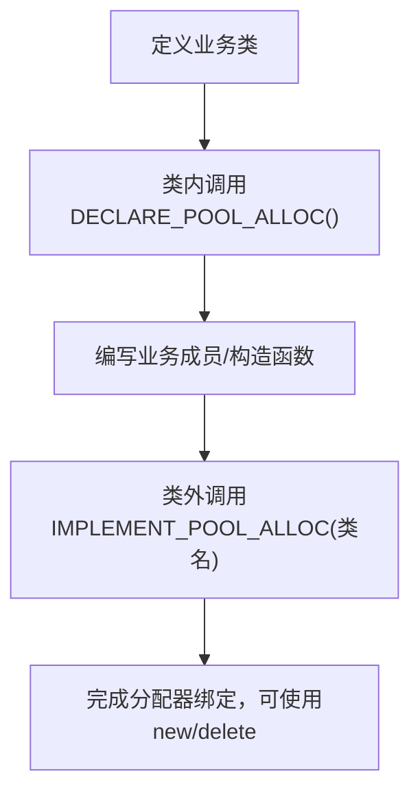
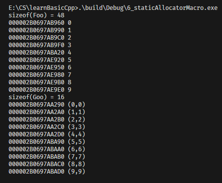

在[5_staticAllocator](../5_staticAllocator)的传统静态分配器实现中（如前版 Foo/Goo 类），每个业务类都需要重复编写：
- `static Allocator alloc` 静态成员声明；
- `operator new/delete` 重载函数；
- `Allocator className::alloc` 静态成员初始化。

这种重复代码会导致：
- 开发效率低（每个类都要写相同逻辑）；
- 易出错（手动编写易出现语法错误、函数签名不一致）；
- 维护成本高（修改分配逻辑需逐个修改所有类）。

这里使用了**宏封装**：使用`DECLARE_POOL_ALLOC()` 和 `IMPLEMENT_POOL_ALLOC()` 两个宏，将重复的分配器绑定逻辑封装为“一键式”调用，实现「代码复用、简化开发、统一维护」。

| 实现方式       | 代码量 | 复用性 | 维护成本 | 出错概率 |
| -------------- | ------ | ------ | -------- | -------- |
| 手动绑定分配器 | 多     | 低     | 高       | 高       |
| 宏封装分配器   | 少     | 高     | 低       | 低       |

## 1. 宏定义与核心实现解析
### 1.1 两个核心宏的定义
```cpp
// 宏1：DECLARE_POOL_ALLOC - 类内声明（声明静态分配器+重载new/delete）
#define DECLARE_POOL_ALLOC()                                                      \
public:                                                                           \
    void *operator new(size_t size) { return alloc.allocate(size); }              \
    void operator delete(void *ptr, size_t size) { alloc.deallocate(ptr, size); } \
                                                                                  \
protected:                                                                        \
    static Allocator alloc;

// 宏2：IMPLEMENT_POOL_ALLOC - 类外实现（初始化静态分配器实例）
#define IMPLEMENT_POOL_ALLOC(className) Allocator className::alloc;
```

#### 宏1（DECLARE_POOL_ALLOC()）拆解
| 代码段                                                 | 作用                                                                 |
| ------------------------------------------------------ | -------------------------------------------------------------------- |
| `public:`                                              | 保证 `operator new/delete` 为公有（符合C++标准，new/delete必须公有） |
| `void *operator new(size_t size) { ... }`              | 重载new：调用静态分配器的`allocate`方法分配内存                      |
| `void operator delete(void *ptr, size_t size) { ... }` | 重载delete：调用静态分配器的`deallocate`方法归还内存                 |
| `protected: static Allocator alloc;`                   | 声明静态分配器实例（protected避免外部直接访问，仅类内/子类可用）     |

#### 宏2（IMPLEMENT_POOL_ALLOC(className)）拆解
- 核心逻辑：`Allocator className::alloc;` → 为指定类初始化静态分配器成员，解决「静态成员必须类外初始化」的C++语法要求；
- 传参 `className`：适配不同业务类（Foo/Goo），实现通用初始化。

### 1.2 业务类接入宏封装的流程
#### Foo类（示例）
```cpp
class Foo
{
    DECLARE_POOL_ALLOC() // 1. 类内调用声明宏
public:
    long L;
    string str;

public:
    Foo(long l, const string &s) : L(l), str(s) {}
};
IMPLEMENT_POOL_ALLOC(Foo) // 2. 类外调用实现宏
```

#### Goo类（示例）
```cpp
class Goo
{
    DECLARE_POOL_ALLOC() // 1. 类内调用声明宏
public:
    complex<double> c;

public:
    Goo(const complex<double> &x) : c(x) {}
};
IMPLEMENT_POOL_ALLOC(Goo) // 2. 类外调用实现宏
```

#### 接入流程总结


### 1.3 分配器核心逻辑（无变化）
```cpp
class Allocator
{
private:
    struct obj { struct obj *next; }; // 空闲链表节点
    obj *freeStore = nullptr;         // 空闲链表头
    const int CHUNK = 5;              // 单次预分配5个对象

public:
    // 内存分配：空闲链表为空则预分配大块内存，否则取头节点
    void *allocate(size_t size)
    {
        obj *p;
        if (!freeStore)
        {
            size_t chunk = CHUNK * size;
            freeStore = p = (obj *)malloc(chunk);
            for (int i = 0; i < CHUNK - 1; ++i)
            {
                p->next = (obj *)((char *)p + size);
                p = p->next;
            }
            p->next = nullptr;
        }
        p = freeStore;
        freeStore = freeStore->next;
        return p;
    }

    // 内存释放：将节点插回空闲链表头部
    void deallocate(void *ptr, size_t size)
    {
        ((obj *)ptr)->next = freeStore;
        freeStore = (obj *)ptr;
    }
};
```

## 2. 宏封装的核心设计思想
### 2.1 代码复用与标准化
- 把「静态分配器绑定」的重复逻辑（`new/delete`重载、静态成员声明/初始化）封装为宏，所有业务类只需两行代码即可接入，避免“复制-粘贴”式编程；
- 统一分配器调用逻辑：所有类的`new/delete`都调用`alloc.allocate/deallocate`，保证分配策略一致。

### 2.2 作用域控制
- `alloc` 声明为`protected`：既避免外部直接修改分配器（防止误操作），又允许子类继承分配器逻辑（子类可复用父类的分配器，或重写）；
- `operator new/delete` 声明为`public`：符合C++语法要求（new/delete必须是公有成员，否则无法在全局调用）。

### 2.3 通用性与适配性
- 实现宏 `IMPLEMENT_POOL_ALLOC(className)` 通过参数`className`适配任意类，无需为每个类写专属初始化代码；
- 分配器类`Allocator`与宏解耦：修改分配器逻辑（如调整CHUNK、加线程锁），所有通过宏接入的类都会自动生效，无需逐个修改。

### 2.4 低侵入性
- 宏仅在类内添加必要的成员/函数，不影响业务类的原有逻辑（如Foo的`L/str`成员、构造函数完全不变）；
- 保留业务类的扩展性：可在类内添加自定义方法，不会与宏定义的内容冲突。

## 3. 宏封装的扩展与注意事项
### 3.1 扩展1：支持自定义CHUNK大小
原分配器的CHUNK固定为5，可修改宏和分配器，支持按类自定义CHUNK：
```cpp
// 改进后的声明宏（支持传CHUNK参数）
#define DECLARE_POOL_ALLOC(chunkSize)                                             \
public:                                                                           \
    void *operator new(size_t size) { return alloc.allocate(size); }              \
    void operator delete(void *ptr, size_t size) { alloc.deallocate(ptr, size); } \
                                                                                  \
protected:                                                                        \
    static Allocator<chunkSize> alloc;

// 改进后的实现宏
#define IMPLEMENT_POOL_ALLOC(className) Allocator<className::CHUNK> className::alloc;

// 模板化Allocator，支持动态CHUNK
template<int CHUNK>
class Allocator
{
private:
    struct obj { struct obj *next; };
    obj *freeStore = nullptr;
    const int CHUNK_SIZE = CHUNK; // 自定义CHUNK大小
public:
    void *allocate(size_t size) { /* 逻辑不变，替换CHUNK为CHUNK_SIZE */ }
    void deallocate(void *ptr, size_t size) { /* 逻辑不变 */ }
};

// Foo类使用CHUNK=10，Goo类使用CHUNK=8
class Foo
{
    DECLARE_POOL_ALLOC(10)
public:
    long L;
    string str;
    Foo(long l, const string &s) : L(l), str(s) {}
};
IMPLEMENT_POOL_ALLOC(Foo)
```

### 3.2 扩展2：添加线程安全锁
在Allocator中加锁，宏封装的类自动获得线程安全：
```cpp
#include <mutex>
class Allocator
{
private:
    std::mutex mtx; // 互斥锁
    struct obj { struct obj *next; };
    obj *freeStore = nullptr;
    const int CHUNK = 5;
public:
    void *allocate(size_t size)
    {
        std::lock_guard<std::mutex> lock(mtx); // 加锁
        // ... 原有逻辑 ...
    }
    void deallocate(void *ptr, size_t size)
    {
        std::lock_guard<std::mutex> lock(mtx); // 加锁
        // ... 原有逻辑 ...
    }
};
```

### 3.3 注意事项
#### 1. 宏的换行符转义
- 宏定义中每行末尾的`\`是换行符转义，必须保留，否则宏会解析失败；
- 宏内的代码缩进不影响功能，但需保证语法正确（如括号、分号齐全）。

#### 2. 避免宏名冲突
- 宏名`DECLARE_POOL_ALLOC`/`IMPLEMENT_POOL_ALLOC`需保证唯一性，建议添加项目前缀（如`MY_DECLARE_POOL_ALLOC`）；
- 避免在类内定义同名的`alloc`成员或`operator new/delete`，否则会与宏定义冲突。

#### 3. 继承场景的注意事项
- 子类若使用`DECLARE_POOL_ALLOC()`，会覆盖父类的`operator new/delete`；
- 若需子类复用父类的分配器，可将父类的`alloc`声明为`public`，子类直接调用。

#### 4. 内存泄漏问题
- 宏封装仅简化绑定逻辑，分配器的大块内存仍未释放（delete仅归还到空闲链表）；
- 解决方案：为Allocator添加析构函数，程序退出时释放所有预分配内存（参考前版Note.md的扩展方案）。

## 4. 核心总结
1. **宏封装核心价值**：将静态分配器的重复绑定逻辑封装为两个宏，实现「代码复用、简化开发、统一维护」，运行时行为与手动绑定完全一致；
2. **宏的分工**：
   - `DECLARE_POOL_ALLOC()`：类内声明静态分配器+重载new/delete；
   - `IMPLEMENT_POOL_ALLOC(className)`：类外初始化静态分配器实例；
3. **设计亮点**：
   - 作用域控制：`alloc`为protected，new/delete为public，兼顾安全性和语法合规；
   - 通用性：适配任意业务类，修改分配器逻辑可全局生效；
   - 低侵入性：不影响业务类原有逻辑；
4. **扩展建议**：支持自定义CHUNK大小、添加线程安全锁、补充内存释放逻辑，适配生产环境需求。

宏封装静态分配器是C++工程化开发的典型技巧，广泛应用于大型项目的通用内存管理模块（如游戏引擎、服务器框架），既保证了内存分配的性能，又降低了代码维护成本。

+ 6_staticAllocatorMacro测试

和[5_staticAllocator](../5_staticAllocator)一致。

