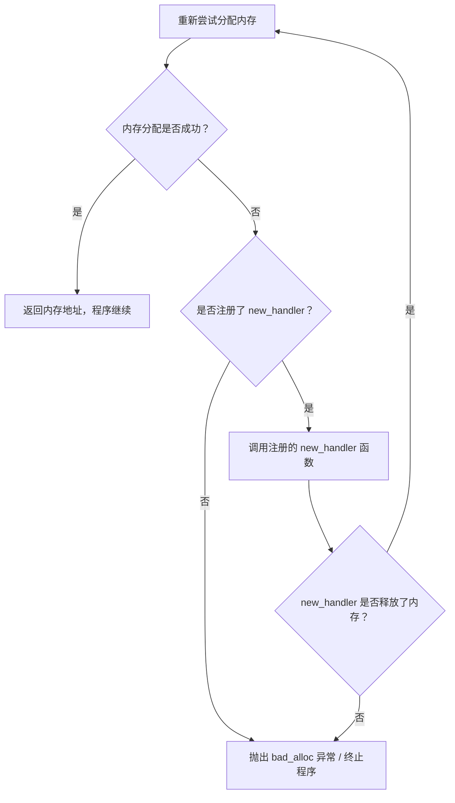
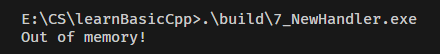

`new_handler` 是 C++ 标准库提供的**内存分配失败回调机制**：当 `operator new`（或 `new[]`）尝试分配内存失败时，会调用用户注册的自定义回调函数（`new_handler`），而非直接抛出异常（C++98）或返回 `nullptr`（C++11 前的非标准行为）。

核心接口：
```cpp
// 头文件：<new>
namespace std {
    typedef void (*new_handler)(); // new_handler 是函数指针类型
    new_handler set_new_handler(new_handler p) noexcept; // 注册回调函数
    new_handler get_new_handler() noexcept; // 获取当前注册的回调函数
}
```


## 1. new_handler 工作原理
### 1.1 核心流程


### 1.2 代码核心逻辑解析
```cpp
#include <iostream>
#include <string>
#include <new>
#include <cassert>
using namespace std;

// 自定义 new_handler 回调函数：内存分配失败时执行
void noMoreMemory()
{
    cout << "Out of memory!" << endl;
    abort(); // 终止程序，不再尝试重新分配
}

int main()
{
    // 注册自定义 new_handler：替换默认的空回调
    set_new_handler(noMoreMemory);

    // 第一次尝试分配超大内存（1000000000000 个 int）
    int *p = new int[1000000000000]; 
    assert(p != nullptr); // 若分配失败，noMoreMemory 会被调用，abort 终止程序

    // 第二次尝试分配更大的内存（1000000000000000000 个 int）
    p = new int[1000000000000000000]; 
    assert(p != nullptr);
    return 0;
}
```

#### 关键函数说明
| 函数                            | 作用                                                                                       |
| ------------------------------- | ------------------------------------------------------------------------------------------ |
| `set_new_handler(noMoreMemory)` | 将 `noMoreMemory` 注册为全局内存分配失败的回调函数，返回之前的 `new_handler`（此处未使用） |
| `noMoreMemory()`                | 分配失败时打印提示并调用 `abort()` 终止程序（无内存释放逻辑，因此不会重试分配）            |
| `abort()`                       | 直接终止进程，触发 SIGABRT 信号，不会执行后续代码（如 `assert`）                           |


## 2. new_handler 的核心使用场景与最佳实践
### 2.1 典型使用场景
1. **内存不足时的优雅处理**：
   在 `new_handler` 中释放缓存、关闭无用资源，尝试为后续分配腾出内存：
   ```cpp
   void noMoreMemory() {
       // 释放全局缓存
       globalCache.clear();
       // 关闭临时文件句柄
       closeTempFiles();
       // 若仍无内存，抛出异常
       throw bad_alloc();
   }
   ```
2. **日志记录与监控**：
   记录内存分配失败的时间、分配大小，便于定位内存泄漏或资源耗尽问题。
3. **程序优雅退出**：
   保存程序状态、释放关键资源，避免直接崩溃导致数据丢失。

### 2.2 最佳实践
1. **避免在 new_handler 中无限循环**：
   若 `new_handler` 未释放内存，会导致 `operator new` 反复调用回调，最终程序卡死。建议在回调中仅尝试 1-2 次释放，失败则抛出异常/终止。
2. **区分 C++ 版本差异**：
   - C++98：`operator new` 分配失败默认抛出 `bad_alloc`，`new_handler` 是唯一的预异常处理机会；
   - C++11+：支持 `nothrow new`（`new (nothrow) T`），分配失败返回 `nullptr`，不会触发 `new_handler`。
3. **跨平台适配**：
   - Linux/macOS（g++）：依赖物理内存检查，易触发 `new_handler`；
   - Windows（MSVC）：依赖虚拟内存，需写入数据才会触发实际内存分配。
4. **注册/注销成对使用**：
   若仅需在某段代码中使用自定义 `new_handler`，使用后应恢复默认：
   ```cpp
   new_handler oldHandler = set_new_handler(noMoreMemory);
   // 执行内存密集型操作
   int *p = new int[1000000000];
   // 恢复默认 new_handler
   set_new_handler(oldHandler);
   ```

### 2.3 常见误区
1. **认为 new_handler 一定会被调用**：
   仅当 `operator new` 判定分配失败时才会触发，MSVC 的虚拟内存机制会规避这一判定。
2. **assert(p != nullptr) 能检测分配失败**：
   若 `new_handler` 中调用 `abort()`，`assert` 不会执行；若未终止程序，`operator new` 可能抛出 `bad_alloc`，`assert` 同样不会执行。
3. **超大数值分配一定会失败**：
   取决于编译器和操作系统的内存管理策略，MSVC 会优先分配虚拟地址。

## 3. new(nothrow)

`new (nothrow) `是 C++ 标准提供的不抛异常版本的内存分配运算符。其核心作用是：
+ 告诉 `operator new`：分配内存失败时不要抛出异常；
+ 要求 `operator new`：分配失败时返回 `nullptr` 作为 “分配失败” 的标识。
`nothrow`对应的重载版本代码是：

```cpp
// 普通版本（抛异常）
void* operator new(std::size_t size);
// nothrow 版本（不抛异常）
void* operator new(std::size_t size, const std::nothrow_t&) noexcept;

// 数组版本同理
void* operator new[](std::size_t size);
void* operator new[](std::size_t size, const std::nothrow_t&) noexcept;
```

+ 普通 `new`：分配失败 → 调用 `new_handler` → 仍失败 → 抛出 std::bad_alloc；
+ `new (nothrow)`：分配失败 → 调用 `new_handler` → 仍失败 → 返回 nullptr（不抛异常）。

注意`nothrow` 仅保证「内存分配」阶段不抛异常，构造函数、析构函数抛出的异常仍会正常传播。`new (nothrow) `仍会先调用 `new_handler`，仅当 `new_handler` 无法解决内存不足时，才返回 `nullptr`（而非直接返回）。


## 4. 核心总结
1. **new_handler 核心作用**：内存分配失败时的自定义回调，可用于释放资源、记录日志、优雅退出；
2. **跨编译器差异原因**：
   - g++：严格检查物理内存，超大分配直接失败，触发 `new_handler`，输出 `Out of memory!`；
   - MSVC：依赖 Windows 虚拟内存延迟提交，仅分配地址不占用物理内存，不触发回调，无输出；
3. **触发 MSVC 的 new_handler**：需写入分配的内存（强制物理内存分配），或限制虚拟内存大小；
4. **最佳实践**：
   - 避免无限循环，合理释放内存；
   - 跨平台适配时考虑虚拟内存机制；
   - 注册/注销 `new_handler` 成对使用。

`new_handler` 是 C++ 内存管理的重要补充机制，但需注意编译器和操作系统的差异，避免依赖单一平台的表现编写代码。

5. **nothrow 的核心作用**：作为标记传递给 `operator new`，要求内存分配失败时返回 `nullptr`，而非抛出 `std::bad_alloc` 异常。使用时要包含头文件 `<new>`。仅保证内存分配不抛异常，构造函数异常仍会传播；分配失败时通过 `p == nullptr` 判断，无需 `try-catch`；释放时用普通 `delete/delete[]`即可。


+ 7_newHandlerAndNothrow测试

测试发现只有g++会报错`Out of memory`，但是MSVC不会报错。

