# G2.9的std::alloc

```cpp
enum {__ALIGN = 8};
enum {__MAX_BYTES = 128};
enum {__NFREELISTS = __MAX_BYTES/__ALIGN};

template <bool threads, int inst>
class __default_alloc_template
{
private:
    union obj {
        union obj* free_list_link;
    };
private:
    static obj* volatile free_list[__NFREELISTS];
    static char* start_free;
    static char* end_free;
    static size_t heap_size;
    char* chunk_alloc(size_t size, int& nobjs);
    ...
};

// 令第2级的配器d名称为alloc
typedef __default_alloc_template<false, 0> alloc;

template <bool threads, int inst>
__default_alloc_template <threads, inst>::obj* volatile __default_alloc_template <threads, inst>::free_list[__NFREELISTS] = {0};

template <bool threads, int inst>
char* __default_alloc_template <threads, inst>::chunk_alloc(size_t size, int& nobjs)
{
    char* result;
    size_t total_bytes = size * nobjs;
    size_t bytes_left = end_free - start_free;
    ...
    start_free = (char*)malloc(bytes_to_get);
    if (0 == start_free)
    {
        int i;
        obj* volatile* my_free_list, *p;
        for (i = size; i <= __MAX_BYTES; i += __ALIGN)
        {
            ...
        }
        end_free = 0; // in case of exception
        start_free = (char*)malloc_alloc::allocate(bytes_to_get);
    }
    heap_size += bytes_to_get;
    end_free = start_free + bytes_to_get;
    return (chunk_alloc(size, nobjs));
}
```

可以看到上面的`alloc`是`__default_alloc_template`的特化版本。

用例为：

```cpp
vector<string, std:;alloc<string>> vec;
```

关键函数解析：

## `chunk_alloc`函数

1. 核心功能：**内存池批量分配**
   - 一次性分配多个小内存块（减少频繁 `malloc` 系统调用）
2. 关键变量（内存池全局变量）：
   - `start_free`：内存池**起始地址**
   - `end_free`：内存池**结束地址**
   - `end_free - start_free` = 内存池**剩余可用字节数**

函数原型为：

```cpp
char* chunk_alloc(size_t size, int& nobjs)
```
- `size`：**单个内存块的大小**（已经是对齐后的大小）
- `nobjs`：**引用传递**，想要申请的内存块数量
  ✅ 引用：函数内部可以修改它，返回实际分配的数量

经历以下阶段：

### 1. 初始化与基础计算
```cpp
char* result;
size_t total_bytes = size * nobjs;  // 总共需要的字节数
size_t bytes_left = end_free - start_free;  // 内存池剩余空间
```
- 第一步先算：要多少总内存、内存池还剩多少。

### 2. 内存池空间足够 → 直接分配
```cpp
// 伪代码（你省略的核心逻辑）
if (bytes_left >= total_bytes) {
    result = start_free;
    start_free += total_bytes;  // 移动内存池指针
    return result;  // 直接返回批量内存
}
```
✅ 这是最优情况：内存池够用，**零系统调用，纯指针操作，极快**。

### 3. 内存池空间不足 → 能分多少分多少
```cpp
// 伪代码
else if (bytes_left >= size) {
    nobjs = bytes_left / size;  // 修改实际分配数量
    total_bytes = size * nobjs;
    result = start_free;
    start_free += total_bytes;
    return result;
}
```
- 不够分配 `nobjs` 个，但够分配**若干个完整块**
- 自动减少数量，返回能提供的最大内存。

### 4. 内存池连 1 个块都不够 → 向系统堆申请内存
```cpp
// 向系统申请内存，填充内存池
start_free = (char*)malloc(bytes_to_get);
```
- `bytes_to_get`：申请的总大小（通常是 2 倍需求 + 递增内存）
- 直接调用 C 语言 `malloc` 向操作系统要内存。

### 5. malloc 失败 → 内存耗尽应急处理
```cpp
if (0 == start_free)  // malloc 返回空，系统无内存
{
    int i;
    obj* volatile* my_free_list, *p;
    // 遍历所有更大的自由链表，找空闲内存块回收
    for (i = size; i <= __MAX_BYTES; i += __ALIGN)
    {
        ...  // 从自由链表“挪用”空闲内存
    }
    end_free = 0;  // 防止异常
    // 调用一级配置器（带 out-of-memory 处理）尝试分配
    start_free = (char*)malloc_alloc::allocate(bytes_to_get);
}
```
✅ 这是 STL 的**内存耗尽自救机制**：
1. 遍历更大的空闲链表，回收闲置内存
2. 调用**一级配置器**（可自定义 OOM 处理：抛异常/终止程序）
3. 绝不直接返回空指针，保证健壮性

### 6. 更新内存池状态 + 递归重试
```cpp
heap_size += bytes_to_get;  // 累计已分配堆内存
end_free = start_free + bytes_to_get;  // 更新内存池结束地址
return (chunk_alloc(size, nobjs));  // 递归调用，重新分配
```
- 内存池已补充新内存，**递归调用自己**，重新走分配流程
- 这一次内存池一定有空间，必然分配成功

总结以下流程：

1. 算需求：需要多少总内存、内存池剩多少
2. 够分 → 直接返回内存
3. 不够但能分一部分 → 减少数量返回
4. 完全不够 → 向系统 `malloc` 新内存
5. `malloc` 失败 → 自救回收空闲内存
6. 内存池更新 → 递归重新分配

关键设计亮点包括：
1. **批量分配**：减少系统调用，大幅提升小内存分配效率
2. **内存池复用**：避免频繁创建/释放内存碎片
3. **失败自救**：STL 内存分配几乎不会直接崩溃
4. **递归简化逻辑**：补充内存后直接复用原有分配代码

**总结**

1. 这是 **SGI STL 二级配置器的内存池分配核心**，专门管理**小内存**
2. 核心目标：**少用 malloc、减少碎片、提升速度**
3. 代码逻辑：内存池够用 → 不够用 → 系统申请 → 失败自救 → 重试分配
4. 是 C++ STL 高性能内存管理的经典实现

## `alloc`内存管理的设计

总览图为：

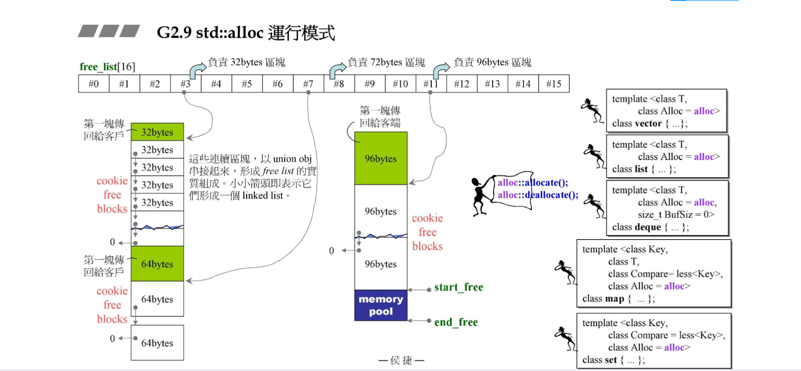

设计了两个内存分配器，注意内存分配器的对象不是给应用程序的，而是给容器的，`free_list`共有16个元素，第一个元素指向大小为8字节的自由链表，第二个元素指向大小为16字节的自由链表，以此类推。每个自由链表的头节点指向下一个空闲内存块。当第一次申请了一个32字节的内存比如`vector<T, alloc> v{...}`，其中`sizeof(T)=32`，那么底层会分配20个32字节的内存（20是一个经验数字），第一个给客户，剩下的19个接在`free_list[3]`后面，考虑后续还有申请，实际会预留20个32字节的内存但是未分配出去，假如下次又来创建元素是64字节的容器，由于前面有预留，实际上会有`32*20/64=10`个内存块，同样第一个给客户，后面的接在`free_list[7]`后面，下一次如果又要创建96字节的容器，由于之前申请的内存都用了，会重新申请20个96字节的内存（同样会多申请20个），第一个给客户，后面的接在`free_list[11]`后面。`free_list`最后一个元素后接的是128字节的内存块，如果申请的内存超过这个数那么就走`malloc`。如果的请d内存不是8的倍数，也会向上取整，比如申请5字节，取整为8字节，使用`free_list[0]`。

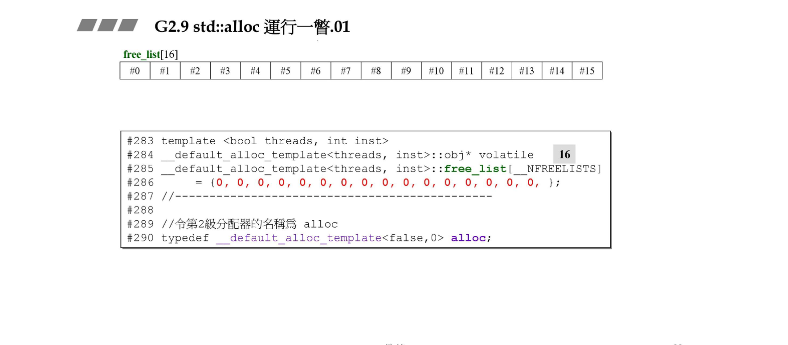

请记住内存分配器的对象不是应用程序，否则应用程序就必须记住要申请的内存大小是多少，还回去也要记住还多少，这是令人恼火的事。实际对象是容器，因为容器记录着每个元素的大小。

具体来说上面的例子用下面的图来形象地描述：

假设内存池（视频称为战备池pool）的大小是x字节，要申请的容器的元素大小为y字节，如果pool里没有了余量，那么就会申请新的内存，计算公式为：$y\times20\times2+RoundUp(y >> 4)$


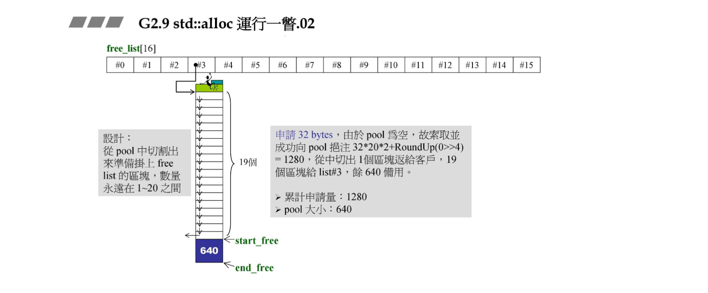

容器申请元素大小32，当前pool为空，累计申请量为$32\times20\times2+RoundUp(0>>4)=1280$字节。用掉$32\times20=640$字节。pool剩余大小为640字节。

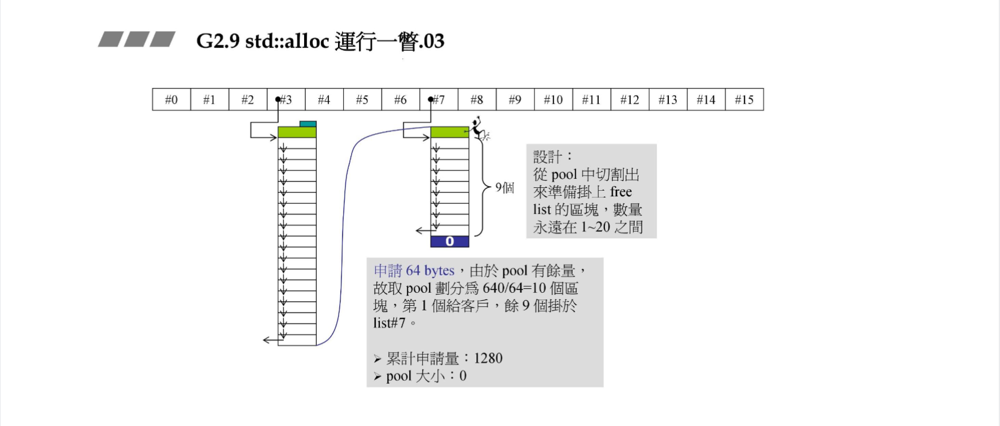

容器申请元素大小为64，当前pool累计申请量为1280字节，还剩640字节，不足20个内存块，原则是有多少用多少，这里$6640/64=10$，所以划分10个内存块，注意切割出来的数量永远在1~20之间。pool剩余大小为0。

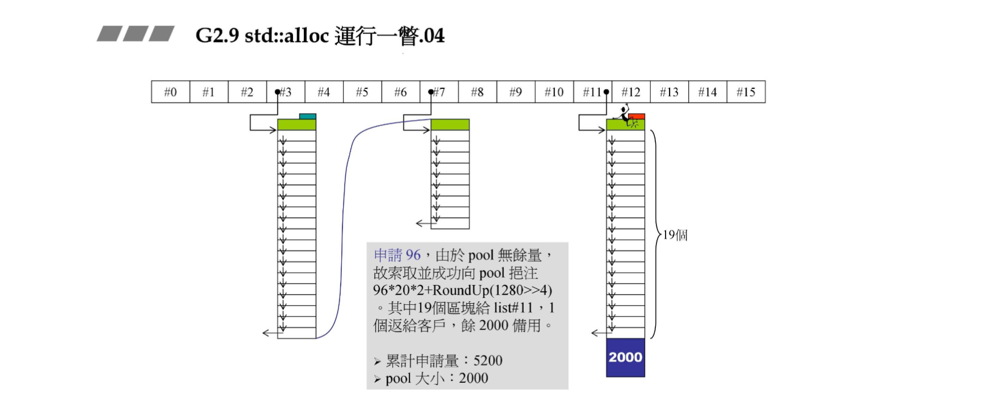

容器申请元素大小为96，当前pool还剩0字节，重新申请$96\times20\times2+RoundUp(1280>>4)=3920$字节，累计申请量为$1280+3920=5200$字节。用掉$96\times20=1920$字节。pool剩余大小为$3920-1920=2000$字节。

注意新申请的会在头部带上cookie，图中也有显示。后面的申请动作也是以此类推：

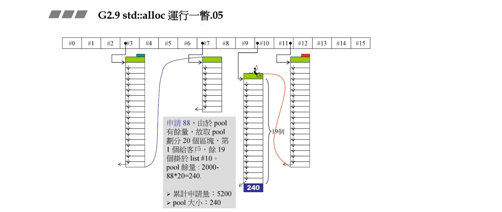

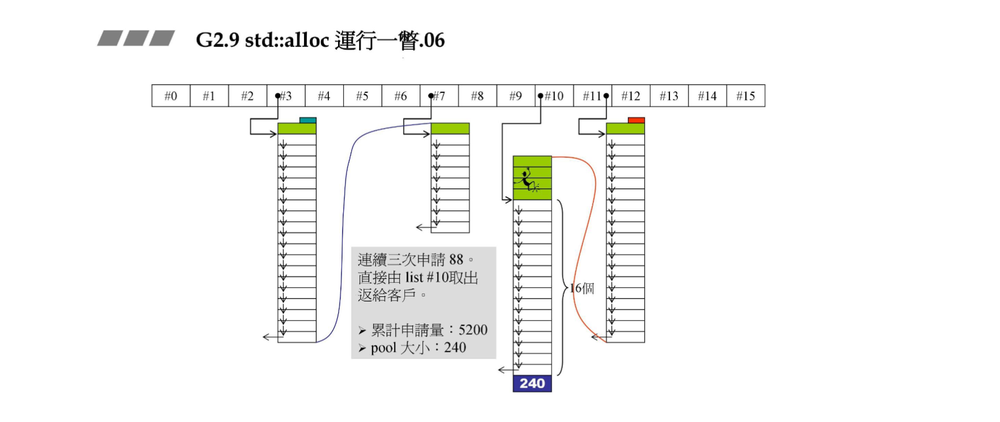

连续申请三个88的内存。

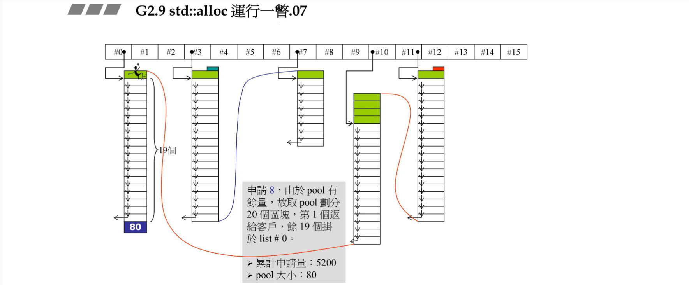

注意现在pool剩余80字节。

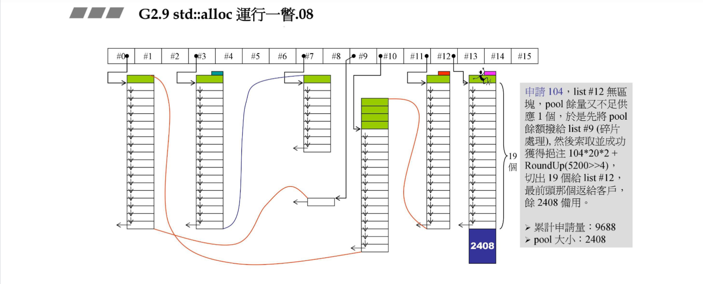

现在申请104,80字节不够一个内存块，先把80字节连接到`free_list[9]`后面，然后按前面的计算公式申请内存。这体现了碎片的处理。

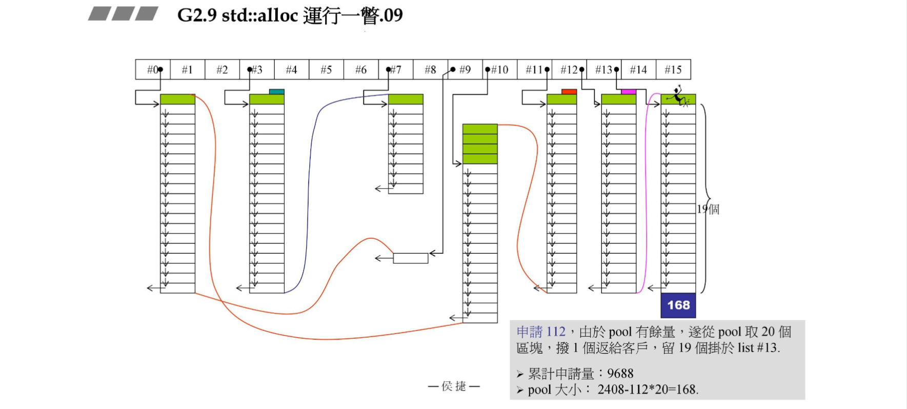

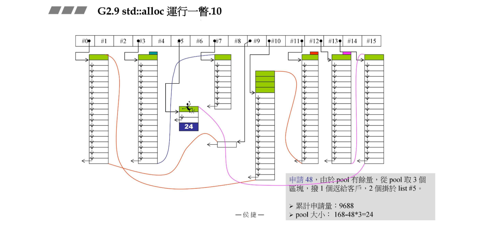

现在已经用掉9688字节了，假设内存的上限是10000字节，那么下一次如果分配失败会发生什么呢？

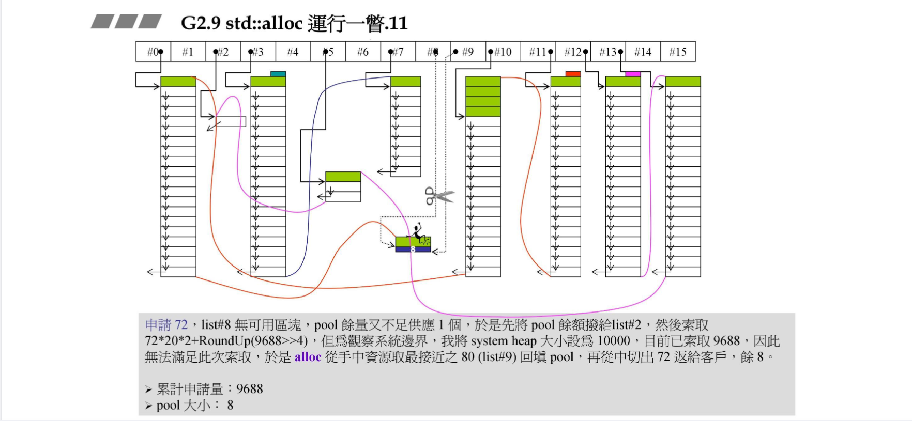

现在申请的是72字节，但是pool剩余24字节，不够一个内存块，先挂到`free_list[2]`后面。然后申请内存，但是达到上限！怎么办呢？所以取的接近的80字节（`free_list[9]`）回填pool，从里面切出72返给客户。而剩下8个字节。

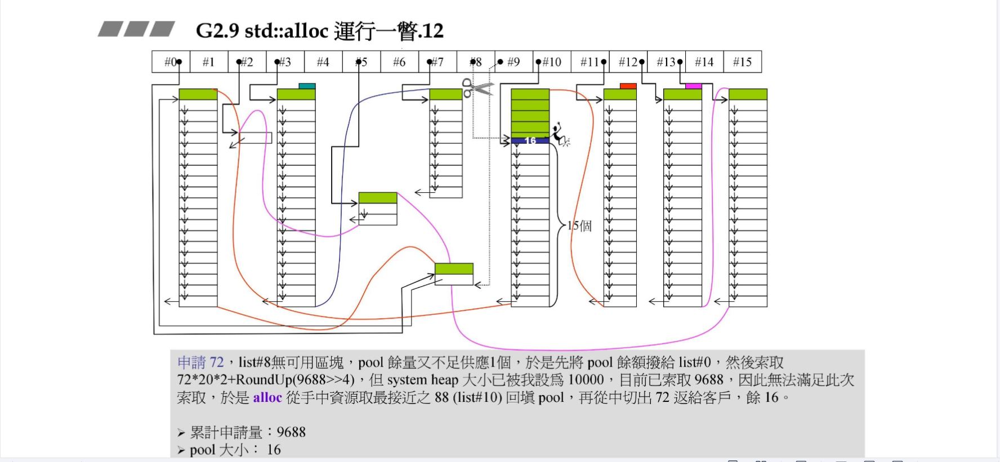

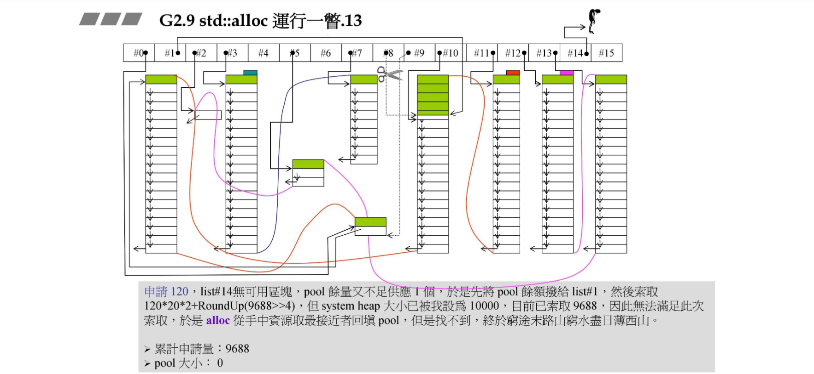

这次要申请k120，结果没有满足的块了！已经山穷水尽了！

检讨：
1. alloc受众可能还有一些未分给客户的内存，可以将这些小内存合成大内存给还g客户吗？技术有点难。
2. 系统的heap可能还有多少资源呢？可不可以把失败的索取量折半折半再折半直到拿到为止呢？但似乎alloc也没有这样设计。

# G4.9的__pool_alloc
`pool_alloc`源码：

```cpp
class __pool_alloc_base
{
protected:
    enum {_S_align = 8};
    enum {_S_max_bytes = 128};
    enum {_S_free_list_size = (size_t)_S_max_bytes/(size_t)_S_align};
    union _Obj
    {
        union _Obj* _M_free_list_link;
        char _M_client_data[1]; // 客户数据
    };
    static _Obj* volatile _S_free_list[_S_free_list_size];
    static char* _S_start_free;
    static char* _S_end_free;
    static size_t _S_heap_size;
    char* _M_allocate_chunk(size_t __n, int& __nobjs);
    ...
};

char* __pool_alloc_base::_M_allocate_chunk(size_t __n, int& __nobjs)
{
    char* __result;
    size_t __total_bytes = __n * __nobjs;
    size_t __bytes_left = _S_end_free - _S_start_free;
    ...
    __try {
        _S_start_free = (char*)malloc(bytes_to_get);
    }
    __catch(const std::bad_alloc&) {
        size_t __i = __n;
        for (; __i <= (size_t)_S_max_bytes; __i += (size_t)_S_align))
        {
            ...
        }
        _S_start_free = _S_end_free = 0;
        __throw_exception_again;
    }
    _S_heap_size += __bytes_to_get;
    _S_end_free = _S_start_free + __bytes_to_get;
    return _M_allocate_chunk(__n, __nobjs);
}

template <typename _Tp>
class __pool_alloc : public __pool_alloc_base
{
public:
    _Tp* allocate(size_t n);
    void deallocate(_Tp* p, size_t n);
    ...
};
```
可以看到`__pool_alloc`继承`__pool_alloc_base`。G4.9和G2.9的设计思想是一致的。其中`_M_allocate_chunk`是内存池分配的核心函数，其设计的思路可以参考上面一节的`chunk_alloc`的解析。池的设计省去了cookie，会比下面的G4.9的标准分配器来得更好。

用例为：

```cpp
vector<string, __gnu_cxx::__pool_alloc<string>> vec;
```


# G4.9标准分配器实现

```cpp
template <typename _Tp>
class new_allocator {
    ...
    pointer allocate(size_type __n, const void* = 0)
    {
        if (__n > this->max_size())
            std::__throw_bad_alloc();
        return static_cast<_Tp*>(malloc(__n * sizeof(_Tp)));
    }

    void deallocate(pointer __p, size_type)
    {
        ::operator delete(__p);
    }
};
#define __allocator_base __gnu_cxx::new_allocator
template <typename _Tp>
class allocator: public __allocator_base<_Tp>
{
    ...
};
```

G4.9的`allocator`只是以`::operator new`和`::operator deelte`完成`allocate()`和`deallocate()`两个函数，没有任何的特殊设计。


+ 8_G2.9std_alloc_G4.9pool_alloc_G4.9allocator测试

msvc测试不能使用`pool_alloc`

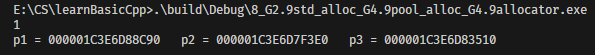

可以看到msvc的`allocator`分配的内存没有规律。

g++可以使用`pool_alloc`

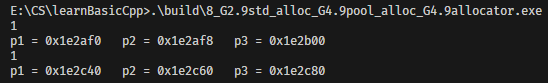

可以看到使用`pool_alloc`分配的内存间隔是8，而默认的`allocator`分配的内存间隔是32（因为内存可能携带了cookie）。
